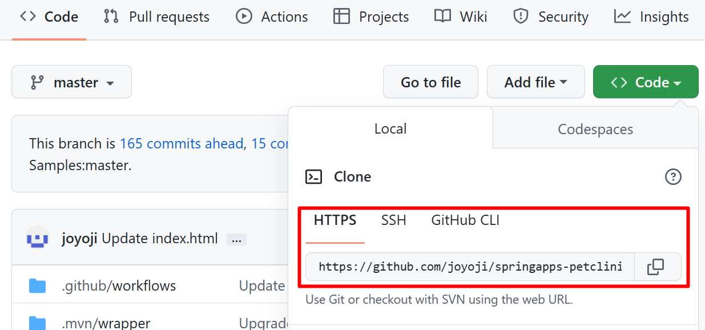

# 事前準備
演習に入る前に準備しておく開発環境の構築や、演習用のプロジェクトの入手について紹介します。
<br><br>

## 1. アカウント
この演習では以下のアカウントが必要です。

お持ちでない場合は以下のリンク先で作成するか、提供されたチケット類がある場合は、提供元からの情報に従いアカウントを作成してください。

   - [**Microsoft Azure**](https://docs.microsoft.com/ja-jp/dotnet/azure/create-azure-account)

   - [**GitHub**](https://github.com/join)


## 2. ローカル開発環境
この演習で使用する開発環境に必要となるツールとランタイム類は以下のとおりです。

リンク先のドキュメントに従いインストールを行い、正常に動作するようあらかじめセットアップしてください。

   - [**OpenJDK**](https://learn.microsoft.com/ja-jp/java/openjdk/download)

      Ver11.0.17 へ移動、各自 OS に対応するものをダウンロード、https://learn.microsoft.com/ja-jp/java/openjdk/install よりインストール

   - [**Maven**](https://maven.apache.org/install.html)
   - [**Git**](https://git-scm.com/book/ja/v2/%E4%BD%BF%E3%81%84%E5%A7%8B%E3%82%81%E3%82%8B-Git%E3%81%AE%E3%82%A4%E3%83%B3%E3%82%B9%E3%83%88%E3%83%BC%E3%83%AB)
   - [**Azure CLI**](https://docs.microsoft.com/ja-jp/cli/azure/install-azure-cli)

      なお Azure CLI のバージョンが古いと動作しないコマンドもありますので、既にインストールされている場合は、以下のドキュメントを参考に更新を行ってください。

      -[**Azure CLI 更新する方法**](https://docs.microsoft.com/ja-jp/cli/azure/update-azure-cli)

      何らかの事情でローカル環境で Azure CLI が使用できない場合は、Azure ポータルから Azure Cloud Shell を使用することができます。

      使い方については以下を参考にしてください。

      - [**Azure Cloud Shell の概要**](https://docs.microsoft.com/ja-jp/azure/cloud-shell/overview)

   - [**Docker デスクトップ**](https://docs.docker.com/get-docker/) (※) 演習でローカルでのコンテナ アプリの実行を確認する手順を選択しない場合は必要ありません
   - [**Visual Studio Code**](https://code.visualstudio.com/Download)

      Visual Studio Code 拡張

      - [**Azure Resources**](https://marketplace.visualstudio.com/items?itemName=ms-azuretools.vscode-azureresourcegroups)
      - [**Azure Spring Apps**](https://marketplace.visualstudio.com/items?itemName=vscjava.vscode-azurespringcloud)
      - [**Visual Studio Docker 拡張**](https://code.visualstudio.com/docs/containers/overview)

<br><br>

## 3. 演習で使用するプロジェクトの入手
このハンズオンでは、ペット クリニックを模したサービスを使用します。同サービスはマイクロサービス アーキテクチャ パターンで開発されています。

サービスは 4 つのコア Spring アプリに分解されます。個別にもデプロイことが可能です。

    - 顧客サービス: 一般的なユーザー入力ロジックと検証が含まれています。ペットと飼い主の情報 (名前、住所、市区町村、電話番号) が含まれます。
    - 訪問サービス: 各ペットのコメントの訪問情報を保存および表示します。
    - 獣医サービス: 名前や専門分野など、獣医の情報を保存および表示します。
    - API ゲートウェイ: システムへの単一のエントリ ポイントです。要求を処理し、適切なサービスにルーティングしたり、複数のサービスを呼び出し、結果を集計したりするために使用されます。
    
    3 つのコア サービスは、外部 API をクライアントに公開します。
    実際のシステムでは、システムの複雑さによって関数の数が急速に増加する可能性があります。 
    1 つの複雑な Web ページのレンダリングには、数百のサービスが関係していることがあります。

ソースコードは以下となります。

[**springapps-petclinic-microservices**]( https://github.com/joyoji/springapps-petclinic-microservices ) サービス本体部分のリポジトリ

[**springapps-petclinic-microservices-config**]( https://github.com/joyoji/springapps-petclinic-microservices-config ) 全て分散アプリケーションのプロパティを管理するためのリポジトリ


### リポジトリのコピー

- **サービス本体部分**
    1. 以下の URL にアクセスし、画面内の右上のボタン `[Fork]` をクリックします  
      https://github.com/joyoji/springapps-petclinic-microservices  
      <br>
    
    2. `Create a new fork` 画面の各項目を以下のように設定します
      
         |  項目  |  値  |
         | ---- | ---- |   
         | Owner * | 自身のアカウント |
         | Repository name * | springapps-petclinic-microservices |
         | Description (Optional) | 任意の説明 |
         | Copy the master branch only | チェック|

   <br>
    
    3. 同ページの `[Create fork]` ボタンをクリックしてご自身の GitHub アカウントに `springapps-petclinic-microservices` リポジトリが作成されたことを確認します
 
-  **UI アプリ**
   - 同様の作業を以下のリポジトリに対しても行います
   https://github.com/horihiro/containerapps-albumui

   >>>>>>>>>>>> ダウンロードせず、設定箇所を変更

<br><br>

## 4. ローカル環境へのリポジトリのクローン

開発環境で作業を行うために、ご自身の GitHub アカウントに作成した演習用アプリケーション springapps-petclinic-microservices をローカルにクローンします。

手順は以下のとおりです。

1. Web ブラウザーでご自身の GitHub アカウントに作成した springapps-petclinic-microservices のリポジトリにアクセスします

2. \[Code\] ボタンをクリックします。\[HTTPS\] タブをアクティブにし、表示されている URL をコピーボタンをクリックしてクリップボードにコピーします

   

3. ローカルの任意のフォルダ(ディレクトリ) にターミナル(コマンド プロンプト)からアクセスし、以下のコマンドを実行します

   ```git clone %前の手順でコピーしたリポジトリの URL% ```

4. コマンドの実行が終了したら ls コマンドで springapps-petclinic-microservices フォルダが作成されていることを確認し、cd コマンドで作業ディレクトリを springapps-petclinic-microservices に切り替えます。cd コマンドの具体的な書式は以下です

   ```cd springapps-petclinic-microservices```

   プロジェクト springapps-petclinic-microservices-config に対しても同様の処理を行います。　
<br><br>

次のタスク : [**演習1) タスク１ - ローカル環境でのプロジェクトの実行**](P1-01.md)へ

戻る : [**Readme**](README.md)へ
