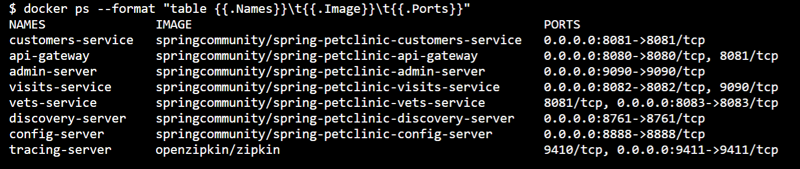

# 演習1) タスク１ - ローカル環境でのプロジェクトの実行

演習 1 では事前準備でローカル環境にクローンした プロジェクトから Visual Studio Code 拡張の機能を使用してローカル環境 Docker イメージを生成し、それを Azure Spring Apps にそれぞれデプロイして動作を確認します。

この演習を行うことで、一般的な Web アプリケーションからの Docker イメージの生成と、生成したイメージの Azure Container Repository への push 方法、Azure Spring Apps へのデプロイ方法を学ぶことができます。

この演習で実施するタスクは以下のとおりです。

>>>>>>>>>>>>>>>>>>>>>>>>>>>>>>>>>>>>>>>>>>>>>>>>>>>更新予定
* [**タスク１ - ローカル環境でのプロジェクトの実行**](P1-01.md#%E6%BC%94%E7%BF%921-%E3%82%BF%E3%82%B9%E3%82%AF%EF%BC%91---%E3%83%AD%E3%83%BC%E3%82%AB%E3%83%AB%E7%92%B0%E5%A2%83%E3%81%A7%E3%81%AE%E3%83%97%E3%83%AD%E3%82%B8%E3%82%A7%E3%82%AF%E3%83%88%E3%81%AE%E5%AE%9F%E8%A1%8C)
* [**タスク 2 - Dockerfile の追加**](https://github.com/osamum/containers-cicd-handson-tutorial/blob/main/steps/P1-02.md)
* [**タスク 3-a - Docker イメージの作成と Azure Container Registry への Push**](P1-03-a.md)
* [**タスク 3-b - Docker イメージの作成と Azure Container Registry への Push**](P1-03-b.md)
* [**タスク 4 - Azure Spring Apps の作成とコンテナーアプリのデプロイ**](P1-04.md)
>>>>>>>>>>>>>>>>>>>>>>>>>>>>>>>>>>>>>>>>>>>>>>>>>>>更新予定

<br><br>

## タスク 1

事前準備でローカル環境にクローンしたプロジェクト **Azure Spring Apps** が Spring Boot アプリケーションとして正しく起動し、Github の Config リポジトリと連携して正しく動作するかを確認します。<br>
ローカル実行は複数の方法があります。
* java コマンドで jar ファイルを直接に実行、例：java -jar spring-petclinic-customers-service/target/*.jar --server.port=8081 --spring.profiles.active=chaos-monkey
* maven のプラグインで実行、例：mvn spring-boot:run -Dspring.profiles.active=development
* Docker コンテナ式で実行、例：docker run -p 3306:3306 springcommunity/spring-petclinic-customers-service:latest
Azure Spring Apps　のインフラ基盤は Kubenetes となっているため、今回はコンテナ式でローカル実行を行います。　

手順は以下の通りです。

### 手順
1. Docker Desktop を起動します

2. プロジェクト **Azure Spring Apps**　について、個別の Bash ターミナル画面で開きます

3. **Azure Spring Apps** のターミナル画面で以下のコマンドを実行します

    mvn clean install -P buildDocker

	以下の内容が表示されたら、実行完了です　<br><br>


4. 以下のコマンドで作成したコンテナイメージを表示します

	docker image list | grep petclinic

	コンテナイメージリストは下記の通りです　<br><br>


5. 以下のコマンドでコンテナを起動します

	docker-compose -f docker-compose.yml --profile mysql, up

6. もう 1 つBash ターミナル画面で開きます、実行しているコンテナのプロセスを確認します。

	docker ps --format "table {{.Names}}\t{{.Image}}\t{{.Ports}}"

	合計 8 個のコンテナが立ち上がりました<br><br>
	

7. UI を確認するため、Web ブラウザーから以下の URL にアクセスし、

	```http://localhost:8080/```

	以下の画面が表示されたことを確認します<br><br>
	<br><br>

	さらに上部の OWNERS メニューを押下し、ALL メニューをクリックします<br><br>
	複数持ち主の詳細情報が表示されたことを確認します<br><br>
	

	
7. API を確認するため、Web ブラウザーから以下の URL にアクセスし、

	http://localhost:8080/api/customer/owners

	JSON のレスオンスが返ってきたことを確認します。


	各ターミナル画面でキーボートの \[Ctrl\] + \[C\] をサービスを終了します。

<br><br>

次のタスク : [**Dockerfile の追加**](P1-02.md)へ

戻る : [**Readme**](README.md)へ
