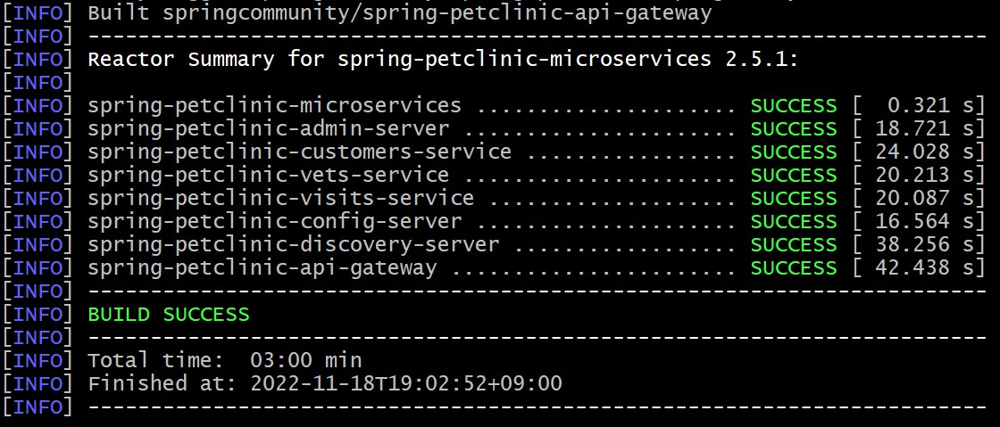
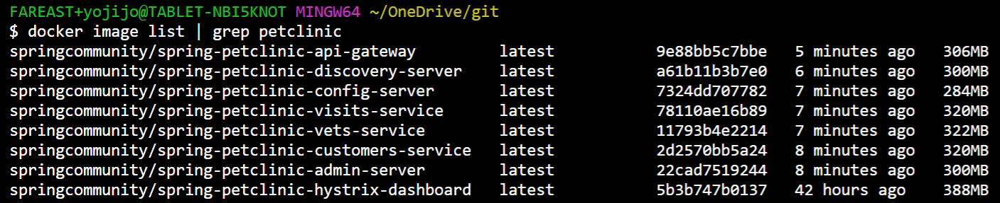
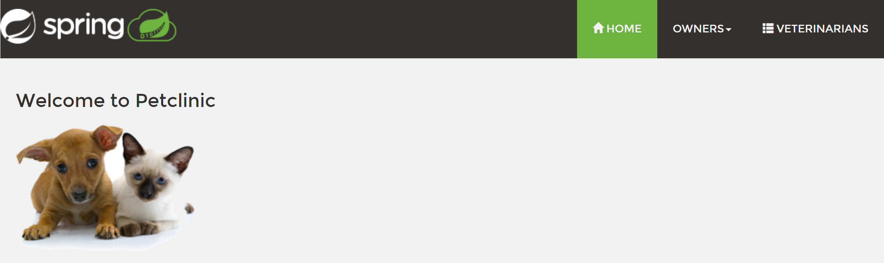
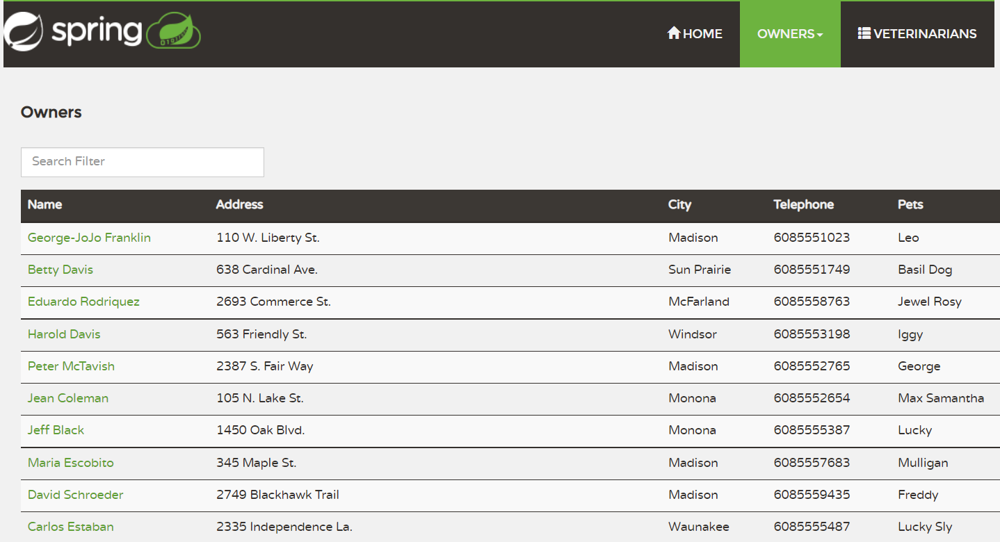
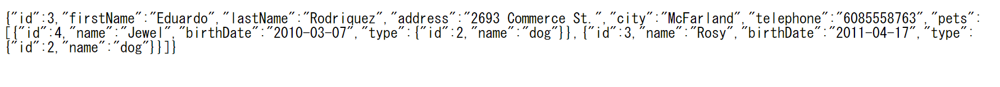

# 演習1) タスク１ - ローカル環境でのプロジェクトの実行

演習 1 では事前準備でローカル環境にクローンした プロジェクトをローカル環境で実行して、動作を確認します。

この演習を行うことで、ローカル環境の実行より、クラウドへデプロイ前に動作確認方法を学ぶことができます。

この演習で実施するタスクは以下のとおりです。

<br><br>

## ローカル環境でのプロジェクトの実行

事前準備でローカル環境にクローンしたプロジェクト **Azure Spring Apps** が Spring Boot アプリケーションとして正しく起動し、Github の Config リポジトリと連携して正しく動作するかを確認します。<br>
ローカル実行は複数の方法があります。
* java コマンドで jar ファイルを直接に実行、例：<br>
 java -jar spring-petclinic-customers-service/target/*.jar --server.port=8081 --spring.profiles.active=chaos-monkey
* maven のプラグインで実行、例：<br>
 mvn spring-boot:run -Dspring.profiles.active=development
* Docker コンテナ式で実行、例：<br>
 docker run -p 3306:3306 springcommunity/spring-petclinic-customers-service:latest

Azure Spring Apps は Kubenetes を基盤にして構築されたため、今回はコンテナ式でローカル実行を行います。　


### 作業
1. Docker Desktop を起動します。

2. プロジェクト **Azure Spring Apps**　について、個別の Bash ターミナル画面で開きます。

3. **Azure Spring Apps** のターミナル画面で以下のコマンドを実行します。

    mvn clean install -P buildDocker

	以下の内容が表示されたら、実行完了です　<br><br>



4. 以下のコマンドで作成したコンテナイメージを表示します。

	docker image list | grep petclinic

	コンテナイメージリストは下記の通りです　<br><br>


5. 以下のコマンドでコンテナを起動します。

	docker-compose -f docker-compose.yml up

6. もう 1 つBash ターミナル画面で開きます、実行しているコンテナのプロセスを確認します。

	docker ps --format "table {{.Names}}\t{{.Image}}\t{{.Ports}}"

	合計 8 個のコンテナが立ち上がりました<br><br>
	

## 確認
7. UI を確認するため、Web ブラウザーから以下の URL にアクセスします。

	```http://localhost:8080/```

	以下の画面が表示されたことを確認します<br><br>
	<br><br>

	さらに上部の OWNERS メニューを押下し、ALL メニューをクリックします。<br><br>
	複数持ち主の詳細情報が表示されたことを確認します。<br><br>
	

	
7. API を確認するため、Web ブラウザーから以下の URL にアクセスします。

	http://localhost:8080/api/customer/owners/3

	JSON のレスオンスが返ってきたことを確認します。

	<br>

	各ターミナル画面でキーボートの \[Ctrl\] + \[C\] を押して、サービスを終了します。

<br><br>

次の手順へ : [**タスク 2 - Azure リソースの作成**](P1-02.md)

前の手順へ : [**事前準備**](Common.md)

READMEへ :  [**README**](../README.md)
