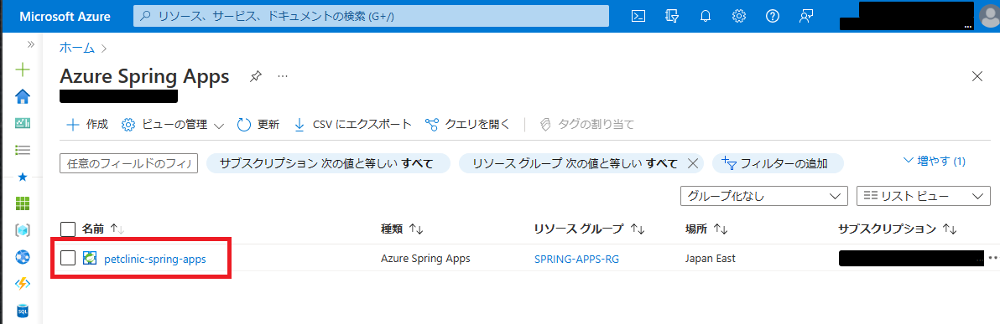
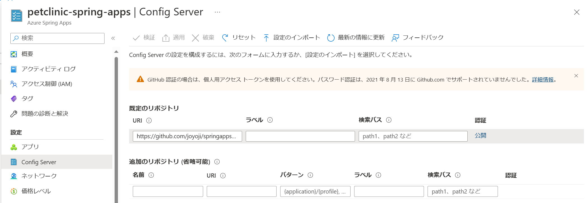

# 演習1) タスク 2 - Azure リソースの作成
Azure へデプロイ前に必要な準備作業を行います。

## 環境設定
1. ターミナル画面を開き、cd コマンドを使用して作業ディレクトリをプロジェクト **springapps-petclinic-microservices** のディレクトリにします

2. 以下のコマンドを実行して Azure にログインします

    ```
    az login
    ```
     既定のブラウザーが開いて Azure サインイン ページが表示され.
    るので、アカウントの資格情報を使用してサインインします。

3. 以下のコマンドを実行するとサブスクリプションの一覧が返るので、今回の演習に使用する SubscriptionId をメモします

    ```
    az account list -o table
    ```

4. 前の手順でメモした SubscriptionId を環境変数にセットします

    \[Bash\]
    ```
    SubscriptionId=メモしたSubscriptionId
    ```

    \[PowerShell\]
    ```
    $env:SubscriptionId="メモしたSubscriptionId"
    ```

5.  以下のコマンドで、環境変数を設定するシェル スクリプトファイル(Bash : setup-env-variables-azure.sh/PowerShell : setup-env-variables-azure.ps1)の内容を書き換えます。

    \[Bash\]

    ```
    sed -i "s/SubscriptionId/${SubscriptionId}/g" .scripts/setup-env-variables-azure.sh
    ```

    \[PowerShell\]

    ```
    $data=Get-Content .scripts/setup-env-variables-azure.ps1 | % {$_ -replace "SubscriptionId",$env:SubscriptionId}
    $data | Out-File .scripts/setup-env-variables-azure.ps1 -Encoding UTF8
    ```

    なおこの作業は手動でファイルを書き換えてもかまいません。

    更新済みのファイルの内容を確認するには以下のコマンドを実行します。

    \[Bash\]
    ```
    cat .scripts/setup-env-variables-azure.sh | grep SUBSCRIPTION
    ```

    \[PowerShell\]
    ```
    Select-String -path .scripts/setup-env-variables-azure.ps1 "SUBSCRIPTION"
    ```

6. シェル スクリプト ファイルを実行し、環境変数を設定します。

    \[Bash\]
    ```
    source .scripts/setup-env-variables-azure.sh
    ```

    \[PowerShell\]
    ```
    . .scripts/setup-env-variables-azure.ps1
    ```


    7. Spring Apps の CLI 拡張機能をインストールします
    
    ```
    az extension add --name spring
    ```

8. 以降のコマンドを簡潔にするため、CLI のデフォルトパラメーターを設定します

    \[Bash\]
    ```
    az configure --defaults \
        group=${RESOURCE_GROUP} \
        location=${REGION} \
        spring=${SPRING_APPS_SERVICE} 
    ```

    \[PowerShell\]
    ```
    az configure --defaults group=$env:RESOURCE_GROUP location=$env:REGION spring=$env:SPRING_APPS_SERVICE
    ```

    設定したデフォルト値を確認します

    ```
    az config get
    ```


## リソースグループと Spring Apps プランを作成

1. リソースグループを作成します
    \[Bash\]
    ```
    az group create --name ${RESOURCE_GROUP} --location ${REGION}

    # 作成済みのリソースグループを確認
    az group list --query "[?name=='${RESOURCE_GROUP}']"
    ```

    \[PowerShell\]
    ```
    az group create --name $env:RESOURCE_GROUP --location $env:REGION

    # 作成済みのリソースグループを確認
    az group list --query "[?name=='$env:RESOURCE_GROUP']"
    ```


2. Spring Apps のプランを作成します。
    
    \[Bash\]
    ```
    az spring create --name ${SPRING_APPS_SERVICE} \
            --sku standard \
            --sampling-rate 100 \
            --resource-group ${RESOURCE_GROUP} \
            --location ${REGION}
    ```

    \[PowerShell\]
    ```
    az spring create --name $env:SPRING_APPS_SERVICE --sku standard --sampling-rate 100 --resource-group $env:RESOURCE_GROUP --location $env:REGION
    ```

     作成には 5 分ほどかかるため、少々お待ちください。


## Spring Cloud Config Server を設定
Config Server は、分散システムのための一元化された構成サービスです。

現時点でローカル ストレージ、Git、および Subversion をサポートしている、プラグ可能なリポジトリ レイヤーを使用します。 

1. Git Bash ターミナル画面に、アプリ直下の application.yml の設定を確認します。

    \[Bash\]
    ```
    grep "uri" application.yml
    ```

    \[PowerShell\]
    ```
    Select-String -path application.yml "uri"
    ```
    このコマンドで期待される返り値は以下です。

    ```
    uri: https://github.com/{各自の github アカウント}/springapps-petclinic-microservices-config
    ```


2. 設定を Azure へ登録するため、以下のコマンドを実行します。

    \[Bash\]
    ```
    az spring config-server set \
        --config-file application.yml \
        --name ${SPRING_APPS_SERVICE}
    ```

    \[PowerShell\]
    ```
    az spring config-server set --config-file application.yml --name $env:SPRING_APPS_SERVICE
    ```

## 確認
1. [**ポータルサイト**](https://portal.azure.com/#view/HubsExtension/BrowseResource/resourceType/Microsoft.AppPlatform%2FSpring) へアクセス、リソースが正常にされたことを確認します。

	<br><br>

2. 対象の `Spring Apps` をクリックして、次の画面に `Config Server` メニューを押下します。

   各自のリポジトリが設定されたことを確認します。

	<br><br>
   

## 参照情報
- <a href="https://learn.microsoft.com/ja-jp/azure/spring-apps/overview" target="_blank">Azure Spring Apps の概要</a>
- <a href="https://learn.microsoft.com/ja-jp/azure/spring-apps/quickstart?tabs=Azure-CLI" target="_blank">初めてのアプリケーションを Azure Spring Apps にデプロイする</a>

---
次の手順へ : [**タスク 3 - Visual Studio Cod を使用した Azure Spring Apps のデプロイ**](P1-03.md)

前の手順へ : [**タスク 1 - ローカル環境でのプロジェクトの実行**](P1-01.md)

READMEへ :  [**README**](../README.md)
