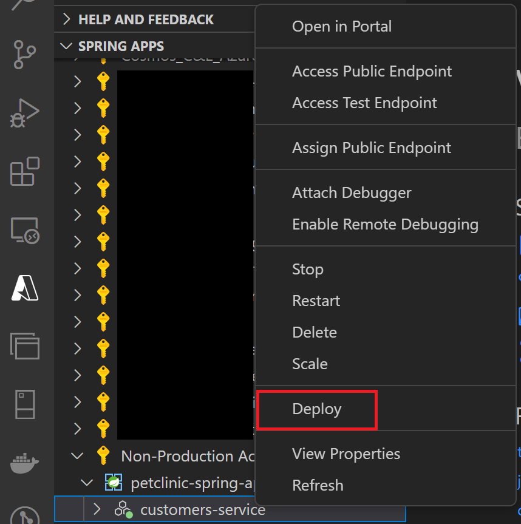

# 演習1) タスク 3 - Visual Studio Cod を使用した Azure Spring Apps のデプロイ
Visual Studio Code でアプリデプロイを行います。

アプリをデプロイします。Visual Studio Code の Azure Spring Apps 拡張機能 または Azure CLI、Github workflow 等の方法があります。

本セッションに 5 のアプリがあります。各アプリのデプロイ方法は以下の通りです。

customers-service : Visual Studio Code 
<br>
admin-server : Azure CLI
<br>
vets-service : Azure CLI
<br>
visits-service : Azure CLI
<br>
api-gateway : Azure CLI


## 事前準備
1. 前のステップに開いた Git Bash ターミナル画面を使用し続けます。
    ```bash
    # springapps-petclinic-microservices の直下であることを確認
    pwd
    ```
<br>

2. ソースコードをコンパイルします。
    ```bash
    mvn clean package -DskipTests -Denv=cloud
    ```

3. Visual Studio Code の横メニューに `Azure アイコン`をクリックします。SPRING APPS 下の `Sign in to Azure...` をクリックします。

	<br><br>

4. 既定のブラウザーが開いて Azure サインイン ページが表示されます。アカウントの資格情報を使用してサインインします。

    成功の場合、ブラウザに以下の画面に表示されます。

	<br><br>

## App の作成 
1. Spring APPS 欄に、自分のアカウントをクリックして展開します。先ほど Azure CLI で作成した Spring APPS プランが表示されます。右クリックして `Create App` をクリックします。
 
	<br><br>

2. App の名称を設定するため customers-service を 入力します。`Enter` を押下します。

	<br><br>

3. Java のランタイムを設定するため Java11 を選択します。`Enter` を押下します。

	<br><br> 

4. Visual Studio Code の右下に進捗欄が表示されます。

	<br><br>       

5. 右下進捗欄に Successfully created Spring app "customers-service". が表示されたら、アプリが作成できました。

   petclinic-spring-apps を展開して、作成した customers-service を確認できます。

	<br><br>

   表示できない場合、 `petclinic-spring-apps` を選択して、右クリックします。メニューから `Refresh` を押下します。
   
	<br><br>         

## App のデプロイ
1. customers-service を表示させます。`Deploy` をクリックします。    
    <br><br> 

2. ローカルマシンのプロジェクトフォルダにある jar ファイルを選択して、`選択`ボタンを押下します。   

    <br><br> 

   右下進捗欄に以下のステータスが表示されます。

    <br><br> 

3. Visual Studio Code の右下に以下のステータスが表示されたら、デプロイ完了です。

   サービスをインターネットに公開する必要があれば、 `Access public endpoint` をクリックします。
   
   今回不要となり、そのままメッセージウィンドウを閉じます。

    <br><br> 


---
次の手順へ : [**タスク 4 - Azure CLI を使用した Azure Spring Apps のデプロイ**](P1-04.md)

前の手順へ : [**タスク 2 - Azure リソースの作成**](P1-02.md)

READMEへ :  [**README**](../README.md)
