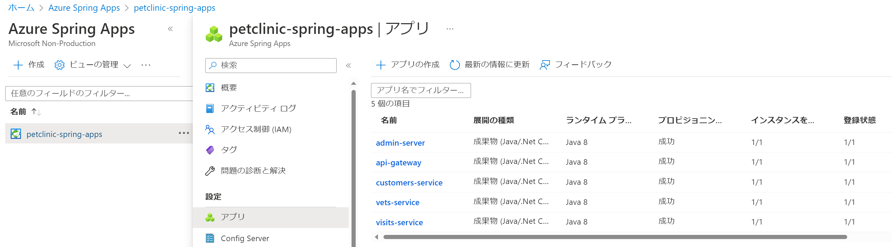
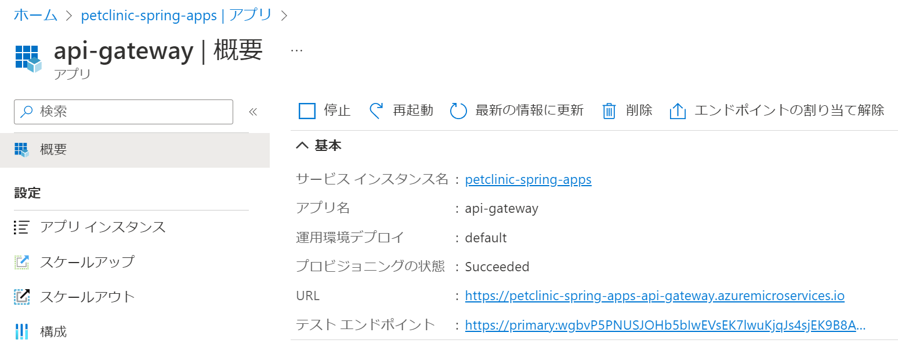
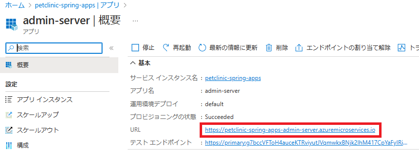
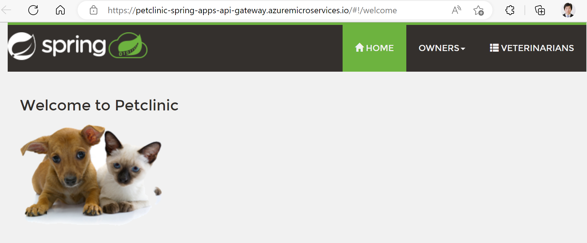
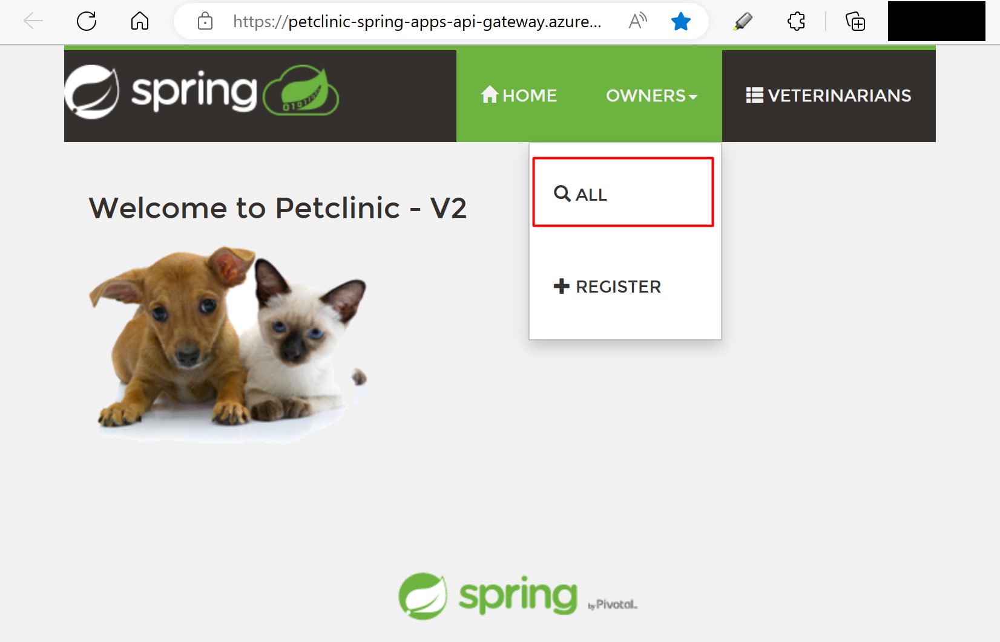
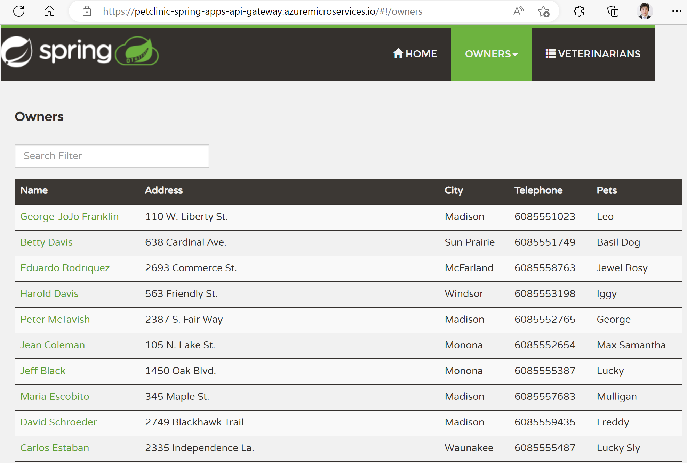
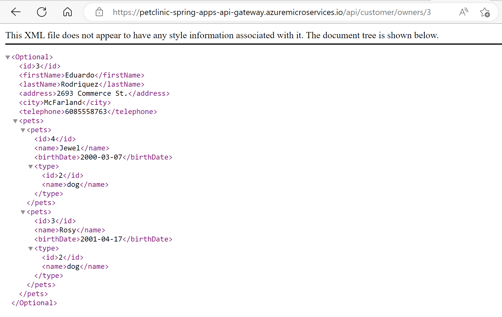
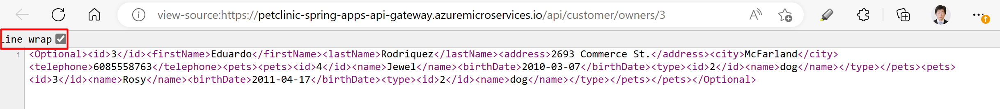
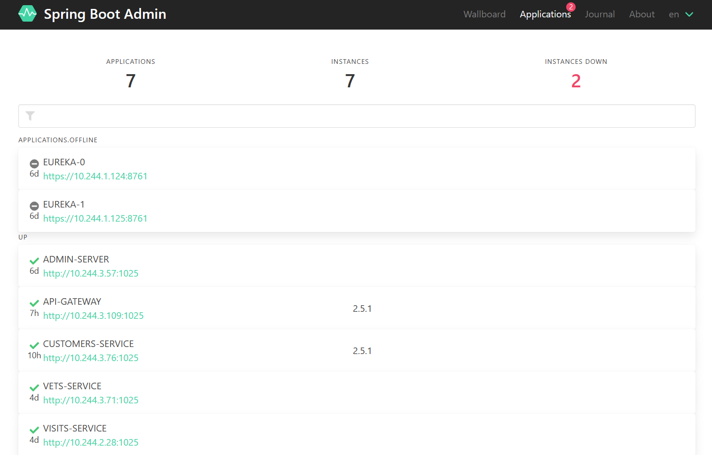
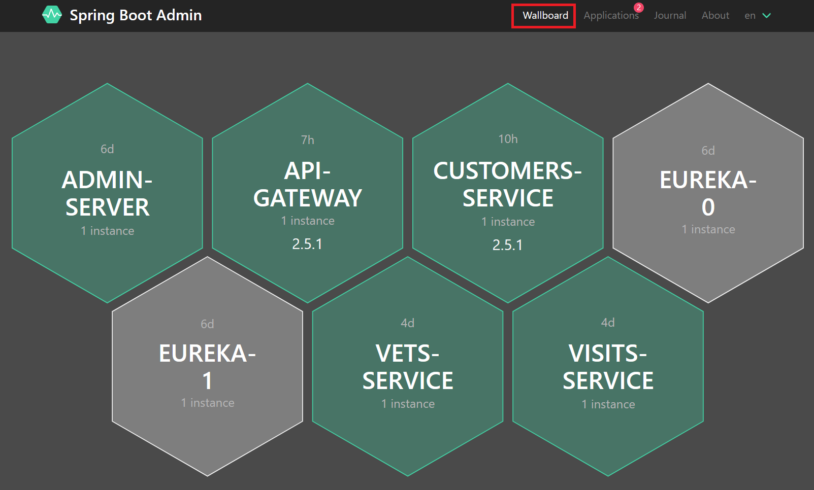

# 演習1) タスク 4 - Azure CLI を使用した Azure Spring Apps のデプロイ
Azure CLI を使用して Azure Spring Apps をデプロイします。

## 作業
1. 下記の順番でアプリを新規作成します。
```bash
    az spring app create --name ${ADMIN_SERVER} --instance-count 1 --assign-endpoint true \
        --runtime-version Java_11 --memory 1Gi \
        --jvm-options='-Xms1024m -Xmx1024m'
        
    az spring app create --name ${VETS_SERVICE} --instance-count 1 \
        --runtime-version Java_11 --memory 1Gi \
        --jvm-options='-Xms1024m -Xmx1024m'
    
    az spring app create --name ${VISITS_SERVICE} --instance-count 1 \
        --runtime-version Java_11 --memory 1Gi \
        --jvm-options='-Xms1024m -Xmx1024m'

    az spring app create --name ${API_GATEWAY} --instance-count 1 --assign-endpoint true \
        --runtime-version Java_11 --memory 1Gi \
        --jvm-options='-Xms1024m -Xmx1024m -Dspring.profiles.active=azure'
```


2. 下記の順番で jar ファイルをデプロイします。
```bash
    az spring app deploy -n ${ADMIN_SERVER} \
        --artifact-path ${ADMIN_SERVER_JAR}


    az spring app deploy -n ${VETS_SERVICE} \
        --artifact-path ${VETS_SERVICE_JAR} 
              
    
    az spring app deploy -n ${VISITS_SERVICE} \
        --artifact-path ${VISITS_SERVICE_JAR} 

    az spring app deploy -n ${API_GATEWAY} \
        --artifact-path ${API_GATEWAY_JAR} \
```

## 確認
1. 下記のリンクよりポータルサイトへアクセスします。

    https://portal.azure.com/#view/HubsExtension/BrowseResource/resourceType/Microsoft.AppPlatform%2FSpring

2. ハンズオン用の `Spring Apps` を選択します。次の画面に`アプリ`をクリックします。

    アプリの一覧が表示されます。プロビジョニングは全て`成功`であることを確認します。<br>
    

## 動作確認
1. アプリ一覧から`api-gateway` をクリックします。`URL` はアクセス用のエンドポイントとなります。メモに記録します。

    

   アプリ一覧から`admin-server` をクリックします。`URL` をメモに記録します。  

    

2. 上記記録した `api-gateway の URL` にアクセスします。

    トップページが表示されます。<br>
    

    `OWNERS` をクリックし、`ALL` メニューを選択します。<br>
 
     <br>

    複数持ち主の詳細情報が表示されたことを確認します。<br>
        

3. API を確認するために、Web ブラウザーから以下の `URL` にアクセスします。

    http://${上記 api-gateway の URL}/api/customer/owners/3

    API のレスポンス表示はブラウザーや設定次第で変わります。下記 Microsoft Edge の表示例となります。

     

    右クリックして、`View page source` を選択します。タグ付きの XML レスポンスが表示されます。

         

4. 上記記録した `admin-server の URL` へアクセスします。

    

    <br>

    `Wallboard` を表示します。

    

## 参照情報
- <a href="https://learn.microsoft.com/ja-jp/azure/spring-apps/overview" target="_blank">Azure Spring Apps の概要</a>
- <a href="https://learn.microsoft.com/ja-jp/azure/spring-apps/how-to-launch-from-source" target="_blank">Azure CLI から Spring Boot アプリケーションをデプロイする方法</a>
- <a href="https://learn.microsoft.com/ja-jp/azure/spring-apps/how-to-maven-deploy-apps" target="_blank">Maven を使用して Spring Boot アプリケーションをデプロイする</a>

---
次の手順へ : [**演習 2) タスク 1 - GitHub Actions 雛形を作成**](P2-01.md)

前の手順へ : [**タスク 2 - Visual Studio Cod を使用した Azure Spring Apps のデプロイ**](P1-03.md)

READMEへ :  [**README**](../README.md)    
