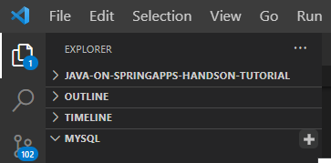
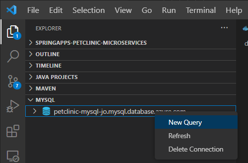
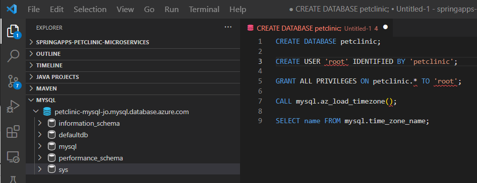
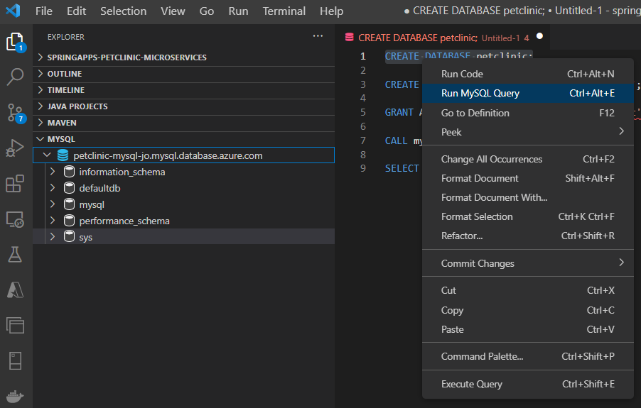
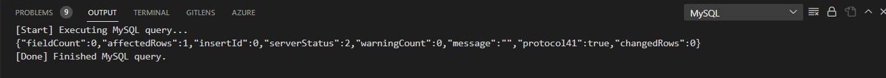

# 準備: Azure リソースを作成
演習 2 に入る前に必要な準備作業を行います。
<br>

## 1. Azure リソースの作成

* [**タスク１ - 環境設定などの事前準備**](P1-01.md#%E6%BC%94%E7%BF%921-%E3%82%BF%E3%82%B9%E3%82%AF%EF%BC%91---%E3%83%AD%E3%83%BC%E3%82%AB%E3%83%AB%E7%92%B0%E5%A2%83%E3%81%A7%E3%81%AE%E3%83%97%E3%83%AD%E3%82%B8%E3%82%A7%E3%82%AF%E3%83%88%E3%81%AE%E5%AE%9F%E8%A1%8C)
* [**タスク 2 - リソースグループお Spring Apps プランの作成**](https://github.com/osamum/containers-cicd-handson-tutorial/blob/main/steps/P1-02.md)
* [**タスク 3 - 接続用の MySQL データベースを作成**](P1-03-a.md)
* [**タスク 4 - アプリケーションの監視設定**](P1-04.md)


## タスク１ - 環境設定などの事前準備

1. Bash ターミナル画面を開きます、プロジェクト **Azure Spring Apps** へ移動
　　cd ${Project_Path}
    pwd

2. 以下のコマンドを実行して Azure にログインします

```bash
    # Azure へログイン
    az login

    # 表示された SubscriptionId をメモにする
    az account list -o table
```

3.  以下のコマンドで環境変数を設定します

```bash
    # 上記メモした SubscriptionId をファイルへ設定
    sed .scripts/setup-env-variables-azure-template.sh $SubscriptionId

    # 更新済みのファイルを確認
    cat .scripts/setup-env-variables-azure-template.sh
```

4. 環境変数を導入します。
```bash
   source .scripts/setup-env-variables-azure.sh
```


## タスク 2 - リソースグループお Spring Apps プランの作成
1. リソースグループを作成します
```bash
    az group create --name ${RESOURCE_GROUP} --location ${REGION}

    # 作成済みのリソースグループを確認
    az group list --query "[?name=='${RESOURCE_GROUP}']"
```

2. Spring Apps のプランを作成します
```bash
    # Spring Apps の CLI 拡張機能をインストール
    az extension add --name spring-cloud

    # 作成は 5 分ほどかかるため、少々お待ちください
    az spring create --name ${SPRING_CLOUD_SERVICE} \
            --sku standard \
            --sampling-rate 100 \
            --resource-group ${RESOURCE_GROUP} \
            --location ${REGION}
```
?????　ポータルサイトでの確認手順を追加する

3. 以降のコマンドを簡潔にするため、CLI のデフォルトパラメーターを設定します
```bash
    az configure --defaults \
        group=${RESOURCE_GROUP} \
        location=${REGION} \
        spring-cloud=${SPRING_CLOUD_SERVICE}

    # 設定済みのデフォルト値を確認
    az config get
```


## タスク 3 - 接続用の MySQL データベースを作成
1. MySQL データベースを作成します
```bash
    # 重複を避けるため、petclinic-mysqlXXX の XXX を任意の連番数字で入替
    # admin-user & admin-password はデフォルト以外の値を設定しても良い
    MYSQL_NAME=petclinic-mysqlXXX
    az mysql server create --name $MYSQL_NAME --admin-user myadmin --admin-password SuperS3cr3t --sku-name GP_Gen5_2 

    # 接続情報を取得, fullyQualifiedDomainNam の値を記録します
    az mysql server show -n $MYSQL_NAME
```

2. firewall rule , local から接続するために設定を追加！！！！

```bash
     --server ${MYSQL_SERVER_NAME} \
     --resource-group ${RESOURCE_GROUP} \
     --start-ip-address <ip-address-of-your-dev-machine> \
     --end-ip-address <ip-address-of-your-dev-machine>
```
>>>>>>>
>>>>>>> # プラグインのインストールは事前準備へ移します
>>>>>>>

3. MySQL データベースへ接続するための VS code 拡張機能をインストールします

Install ボタンをクリック、次のページに 再度 Install ボタンをクリック
https://marketplace.visualstudio.com/items?itemName=formulahendry.vscode-mysql

4. MySQL への接続を作成します
    MySQL へ移動します、+ をクリック
    

    次の画面に入力内容は以下となっているので、順番通り入力していきます。

    ホスト名 (localhost) : 上記 az mysql server show -n $MYSQL_NAME から出力した fullyQualifiedDomainNam の値 <br>
    ログインユーザー名 (root) : myadmin  <br>
    ログインパスワード(root) : SuperS3cr3t  <br>
    ポート (自身の環境で立てたポート番号) : 3306  <br>
    (オプション)SSL証明書のパス(なしでOK) : なし <br>

5. 作成済みの MySQL Connection を選択して右クリック、New Query を選択します

    

6. 表示された VS Code ウィンドウに以下のコマンドを貼り付けします

    
```bash
  CREATE DATABASE petclinic;

  CREATE USER 'root' IDENTIFIED BY 'petclinic';

  GRANT ALL PRIVILEGES ON petclinic.* TO 'root';

  CALL mysql.az_load_timezone();

  SELECT name FROM mysql.time_zone_name;
```
    
7. 一行を選択して、右クリックでメニューをポップアップさせて、Run MySQL Query をクリック

    

    実行結果は以下の通り

    

    繰り返して、ほかの SQL コマンドを実行


## タスク 4 - アプリケーションの監視設定

Create and configure Log Analytics Workspace
Create a Log Analytics Workspace using Azure CLI:
```bash
    az monitor log-analytics workspace create \
        --workspace-name ${LOG_ANALYTICS} \
        --resource-group ${RESOURCE_GROUP} \
        --location ${REGION}

    export LOG_ANALYTICS_RESOURCE_ID=$(az monitor log-analytics workspace show \
        --resource-group ${RESOURCE_GROUP} \
        --workspace-name ${LOG_ANALYTICS} | jq -r '.id')

    export SPRING_CLOUD_RESOURCE_ID=$(az spring-cloud show \
        --name ${SPRING_CLOUD_SERVICE} \
        --resource-group ${RESOURCE_GROUP} | jq -r '.id')
Setup diagnostics and publish logs and metrics from Spring Boot apps to Azure Log Analytics:

    az monitor diagnostic-settings create --name "send-logs-and-metrics-to-log-analytics" \
        --resource ${SPRING_CLOUD_RESOURCE_ID} \
        --workspace ${LOG_ANALYTICS_RESOURCE_ID} \
        --logs '[
             {
               "category": "ApplicationConsole",
               "enabled": true,
               "retentionPolicy": {
                 "enabled": false,
                 "days": 0
               }
             },
             {
                "category": "SystemLogs",
                "enabled": true,
                "retentionPolicy": {
                  "enabled": false,
                  "days": 0
                }
              },
             {
                "category": "IngressLogs",
                "enabled": true,
                "retentionPolicy": {
                  "enabled": false,
                  "days": 0
                 }
               }
           ]' \
           --metrics '[
             {
               "category": "AllMetrics",
               "enabled": true,
               "retentionPolicy": {
                 "enabled": false,
                 "days": 0
               }
             }
           ]'
```


---
次の手順へ: [**タスク 1 - GitHub アクション雛形を作成**](P2-01.md)

READMEへ: [**README**](../README.md#%E6%93%8D%E4%BD%9C%E6%89%8B%E9%A0%86) 
