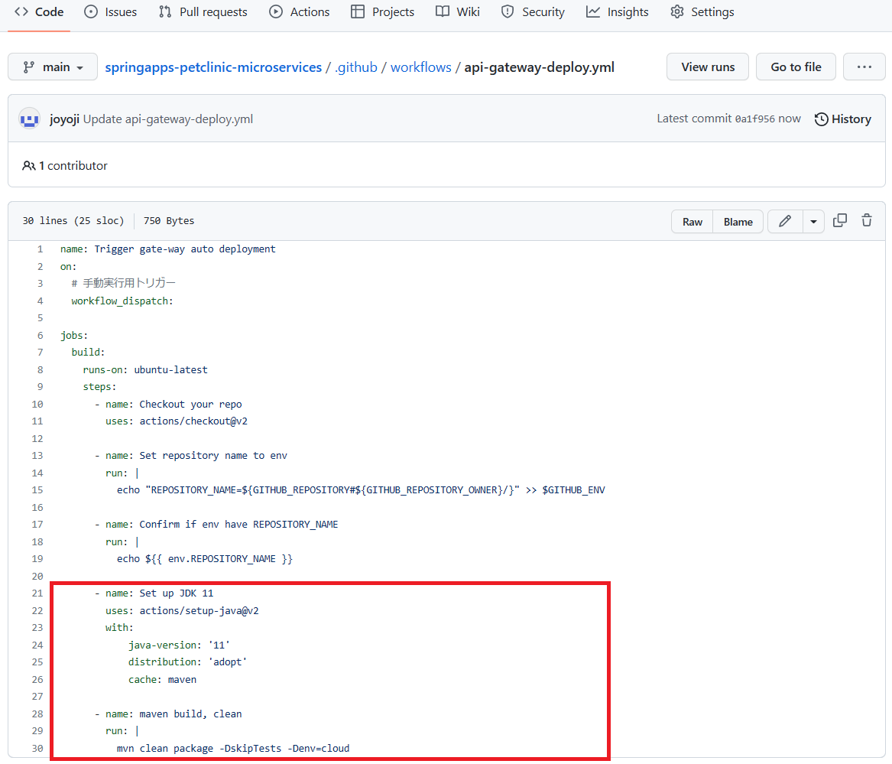
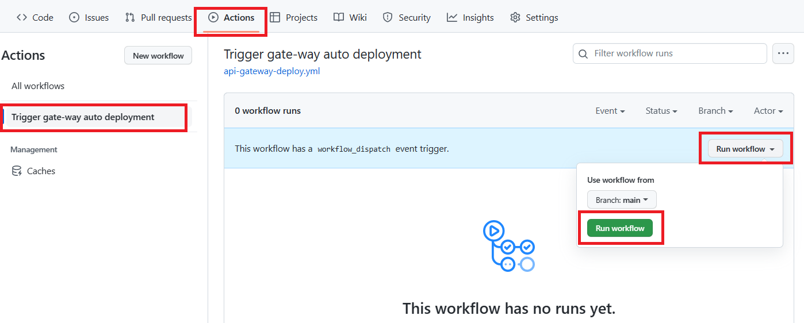
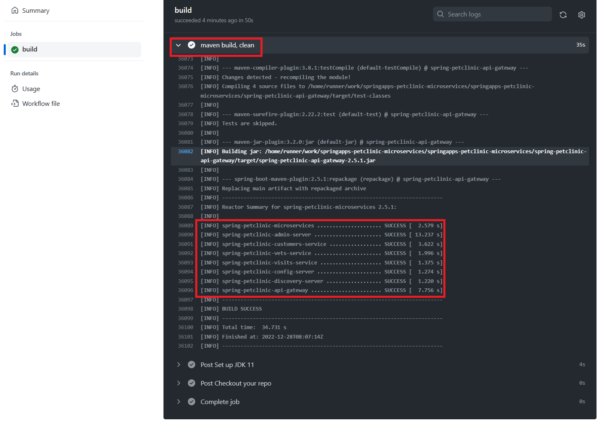

# 演習 2) タスク 2 - アプリのコンパイルジョブ追加
アプリのコンパイルジョブを GitHub アクションに追加します。

> **注:** 演習作業簡略化のため、ファイルの作成と編集は main ブランチに対して直接行います。

## 作業
1. 鉛筆マークのボタンをクリックし、`.github/workflows/api-gateway-deploy.yml` ファイルを編集モードで開きます。

    

2. 下記 `step` のコードを `.github/workflows/api-gateway-deploy.yml` ファイルの末尾に追加します。  

```yaml
    - name: Set up JDK 11
      uses: actions/setup-java@v2
      with:
          java-version: '11'
          distribution: 'adopt'
          cache: maven

    - name: Maven build, clean
      run: |
        mvn clean package -DskipTests -Denv=cloud
```

> **注:**  
> - インデントを注意してください。  
> -  変更内容は直接 `main` ブランチにコミットしてください。　

<br>

Start commitをクリックし、Commit directly to the main branchとなっていることを確認した上で、Commit changeseボタンをクリック


## 確認

3. 以下赤枠でマークされている修正内が `.github/workflows/api-gateway-deploy.yml` ファイルに反映されていることを確認します。
  
    
  
4. タスク 1 の 4. と同様に、手動実行でワークフローを起動します。
  
    

5. ワークフロー処理はエラーなく終了し、jar ファイルが作成されていることを確認できます。

    

    

    

## 参照情報

- <a href="https://learn.microsoft.com/ja-jp/azure/spring-apps/overview" target="_blank">Azure Spring Apps の概要</a>

- **GitHub**

    - <a href="https://docs.github.com/en/actions/monitoring-and-troubleshooting-workflows/about-monitoring-and-troubleshooting" target="_blank">About monitoring and troubleshooting</a>
---
次の手順へ: [**タスク 3 - Azure 接続処理を追加**](P2-03.md)

前の手順へ: [**タスク 1 - GitHub アクション雛形作成**](P2-01.md)

READMEへ: [**README**](../README.md#%E6%93%8D%E4%BD%9C%E6%89%8B%E9%A0%86)
