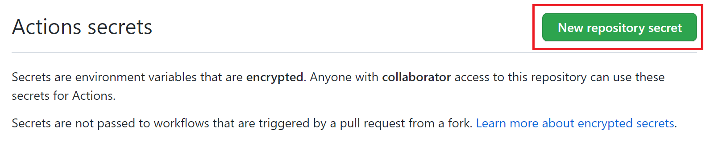
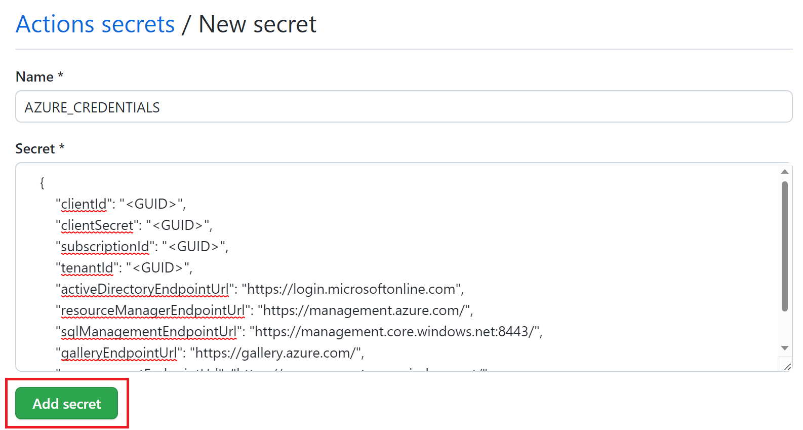

# 演習 2) タスク 3 - Azure 接続処理を追加
GitHub アクションより Azure リソースをデプロイするため、Azure 側と GitHub 側の認証関連の設定を行います。そして、 GitHub アクションに Azure への Login 処理を追加します。

> **注:** 演習作業簡略化のため、ファイルの作成と編集は main ブランチに対して直接行います。

## 作業
### サービス プリンシパルを作成
1. Azure AD アプリの作成、 IAM 設定、Secrets の設定を行います。
```bash
export MSYS_NO_PATHCONV=1 
# サービス プリンシパルを作成し、Azure リソースへのアクセスを設定します。
# --sdk-auth 出力結果は、Azure SDK 認証ファイルと互換性があります。
az ad sp create-for-rbac -n petclinic-spring-apps --role contributor --scopes /subscriptions/${SUBSCRIPTION} --sdk-auth
```

2. 新しく作成されたサービス プリンシパルは以下の通り出力されます。メモに記録しておきます。
    ```bash
    {
        "clientId": "<GUID>",
        "clientSecret": "<GUID>",
        "subscriptionId": "<GUID>",
        "tenantId": "<GUID>",
        "activeDirectoryEndpointUrl": "https://login.microsoftonline.com",
        "resourceManagerEndpointUrl": "https://management.azure.com/",
        "sqlManagementEndpointUrl": "https://management.core.windows.net:8443/",
        "galleryEndpointUrl": "https://gallery.azure.com/",
        "managementEndpointUrl": "https://management.core.windows.net/"
    }
    ```

### GitHub シークレットの作成
3. GitHub シークレットを作成するため、GitHub リポジトリを開き、 [Settings](設定) に移動します。

    

2.  セキュリティ > シークレットと変数 > ] [アクション] の順に選択します。

    

3. New repository secret ボタンをクリックして、シークレットを新規作成します。    

    

4. 以下の通り入力したら、Add secret ボタンを押下します

    GitHub シークレット名: AZURE_CREDENTIALS 

    シークレット値: 上記出力されたサービス プリンシパル

    

## 参照情報

- <a href="https://docs.microsoft.com/ja-jp/azure/active-directory/develop/quickstart-register-app" target="_blank">Microsoft ID プラットフォームにアプリケーションを登録する</a>
- <a href="https://learn.microsoft.com/ja-jp/cli/azure/ad/sp?view=azure-cli-latest#az-ad-sp-create-for-rbac" target="_blank">Azure Active Directory サービス プリンシパルを管理(az ad sp)</a>

- **GitHub**

    - <a href="https://docs.github.com/en/actions/deployment/security-hardening-your-deployments/configuring-openid-connect-in-azure" target="_blank">Configuring OpenID Connect in Azure</a>
    - <a href="https://docs.github.com/ja/actions/deployment/security-hardening-your-deployments/configuring-openid-connect-in-amazon-web-services#adding-permissions-settings" target="_blank">Adding permissions settings</a>
---
次の手順へ: [**タスク 4 - アプリをデプロイする処理を追加**](P2-04.md)

前の手順へ: [**タスク 2 - アプリのコンパイルジョブ追加**](P2-02.md)

READMEへ: [**README**](../README.md#%E6%93%8D%E4%BD%9C%E6%89%8B%E9%A0%86)
