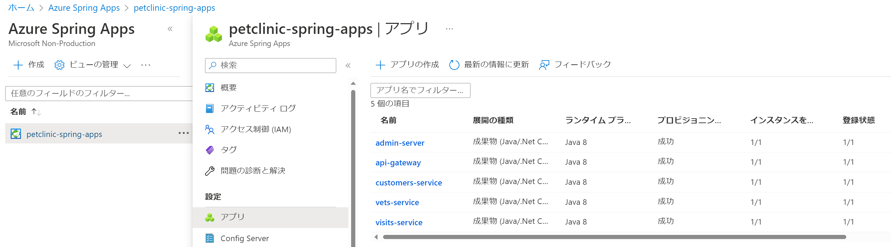
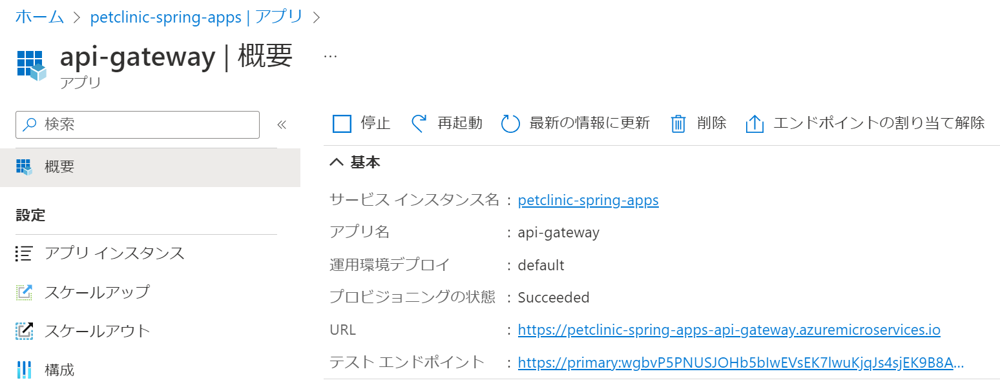
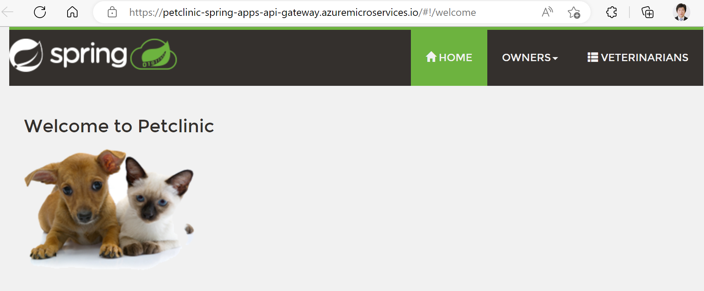
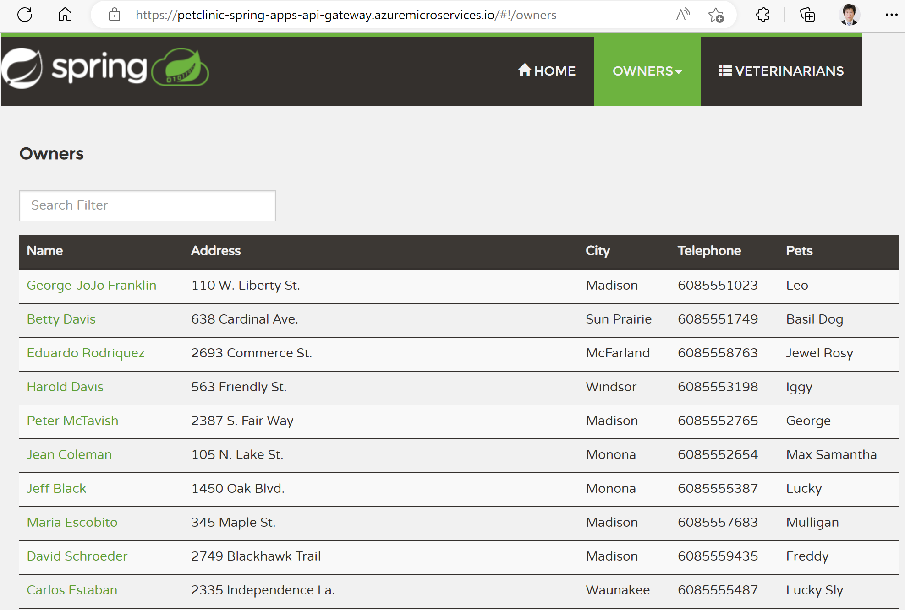
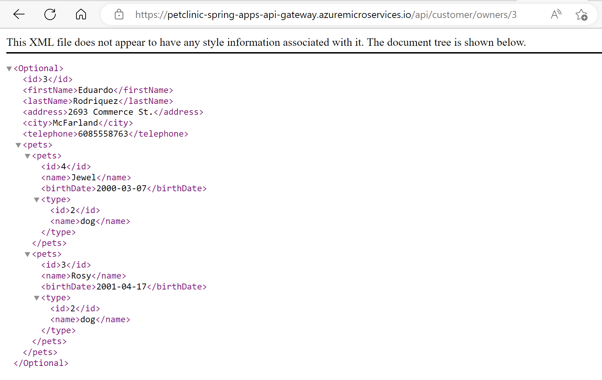

演習 2) タスク 1 - アプリケーションを Azure Spring Apps にデプロイ

アプリをデプロイします。Azure ポータルサイトまたは Azure CLI、Github workflow 等の方法があります。
本セッションに　5 のアプリがあります。1 個目は Azure ポータルサイトでデプロイします。
そのたは Azure CLI を使用します。

api-gateway : ポータルサイト
customers-service : Azure CLI
vets-service : Azure CLI
visits-service : Azure CLI
admin-server : Azure CLI

# 事前準備
1. Bash ターミナル画面を開きます、プロジェクト **Azure Spring Apps** へ移動
```bash
　　cd ${Project_Path}
    pwd
```
<br>

2. 環境変数を導入します
```bash
   source .scripts/setup-env-variables-azure.sh
```

3. ソースコードをコンパイルします
```bash
   mvn clean package -DskipTests -Denv=cloud
```


# デプロイ

1. 順番でアプリを新規作成します
```bash
    az spring app create --name ${API_GATEWAY} --instance-count 1 --assign-endpoint true \
        --runtime-version Java_11 --memory 2Gi \
        --jvm-options='-Xms2048m -Xmx2048m'
    
    az spring app create --name ${ADMIN_SERVER} --instance-count 1 --assign-endpoint true \
        --runtime-version Java_11 --memory 2Gi \
        --jvm-options='-Xms2048m -Xmx2048m'
    
    az spring app create --name ${CUSTOMERS_SERVICE} --instance-count 1 \
        --runtime-version Java_11 --memory 2Gi \
        --jvm-options='-Xms2048m -Xmx2048m'
    
    az spring app create --name ${VETS_SERVICE} --instance-count 1 \
        --runtime-version Java_11 --memory 2Gi \
        --jvm-options='-Xms2048m -Xmx2048m'
    
    az spring app create --name ${VISITS_SERVICE} --instance-count 1 \
        --runtime-version Java_11 --memory 2Gi \
        --jvm-options='-Xms2048m -Xmx2048m'
```

2. 順番でjar ファイルをデプロイします
```bash
    # 以降の Blue/Green デプロイのため、Blue/Green 環境を作成
    az spring app deployment create -n production --app ${API_GATEWAY}
    az spring app deployment create -n production --app ${ADMIN_SERVER}
    az spring app deployment create -n production --app ${CUSTOMERS_SERVICE}
    az spring app deployment create -n production --app ${VETS_SERVICE}
    az spring app deployment create -n production --app ${VISITS_SERVICE}

    # デフォルトの環境を削除
    az spring app deployment delete -n default --app ${API_GATEWAY}
    az spring app deployment delete -n default --app ${ADMIN_SERVER}
    az spring app deployment delete -n default --app ${CUSTOMERS_SERVICE}
    az spring app deployment delete -n default --app ${VETS_SERVICE}
    az spring app deployment delete -n default --app ${VISITS_SERVICE}

    # staging 環境を作成
    az spring app deployment create -n staging --app ${API_GATEWAY}
    az spring app deployment create -n staging --app ${ADMIN_SERVER}
    az spring app deployment create -n staging --app ${CUSTOMERS_SERVICE}
    az spring app deployment create -n staging --app ${VETS_SERVICE}
    az spring app deployment create -n staging --app ${VISITS_SERVICE}

    # production 環境を作成
    az spring app set-deployment -d production -n ${API_GATEWAY}
    az spring app set-deployment -d production -n ${ADMIN_SERVER}
    az spring app set-deployment -d production -n ${CUSTOMERS_SERVICE}
    az spring app set-deployment -d production -n ${VETS_SERVICE}
    az spring app set-deployment -d production -n ${VISITS_SERVICE}

    # 順番でアプリをデプロイ
    az spring app deploy -n ${API_GATEWAY} -d production \
        --artifact-path ${API_GATEWAY_JAR} \
        --jvm-options='-Xms2048m -Xmx2048m -Dspring.profiles.active=mysql,azure'


    az spring app deploy -n ${ADMIN_SERVER} -d production \
        --artifact-path ${ADMIN_SERVER_JAR} \
        --jvm-options='-Xms2048m -Xmx2048m -Dspring.profiles.active=mysql' 
    
    
    az spring app deploy -n ${CUSTOMERS_SERVICE} -d production \
        --artifact-path ${CUSTOMERS_SERVICE_JAR} \
        --jvm-options='-Xms2048m -Xmx2048m -Dspring.profiles.active=mysql' \
        --env MYSQL_SERVER_FULL_NAME=${MYSQL_SERVER_FULL_NAME} \
              MYSQL_DATABASE_NAME=${MYSQL_DATABASE_NAME} \
              MYSQL_SERVER_ADMIN_LOGIN_NAME=${MYSQL_SERVER_ADMIN_LOGIN_NAME} \
              MYSQL_SERVER_ADMIN_PASSWORD=${MYSQL_SERVER_ADMIN_PASSWORD}
    
    
    az spring app deploy -n ${VETS_SERVICE} -d production \
        --artifact-path ${VETS_SERVICE_JAR} \
        --jvm-options='-Xms2048m -Xmx2048m -Dspring.profiles.active=mysql' \
        --env MYSQL_SERVER_FULL_NAME=${MYSQL_SERVER_FULL_NAME} \
              MYSQL_DATABASE_NAME=${MYSQL_DATABASE_NAME} \
              MYSQL_SERVER_ADMIN_LOGIN_NAME=${MYSQL_SERVER_ADMIN_LOGIN_NAME} \
              MYSQL_SERVER_ADMIN_PASSWORD=${MYSQL_SERVER_ADMIN_PASSWORD}
              
    
    az spring app deploy -n ${VISITS_SERVICE} -d production \
        --artifact-path ${VISITS_SERVICE_JAR} \
        --jvm-options='-Xms2048m -Xmx2048m -Dspring.profiles.active=mysql' \
        --env MYSQL_SERVER_FULL_NAME=${MYSQL_SERVER_FULL_NAME} \
              MYSQL_DATABASE_NAME=${MYSQL_DATABASE_NAME} \
              MYSQL_SERVER_ADMIN_LOGIN_NAME=${MYSQL_SERVER_ADMIN_LOGIN_NAME} \
              MYSQL_SERVER_ADMIN_PASSWORD=${MYSQL_SERVER_ADMIN_PASSWORD}
```

# 成果物確認
デプロイ済みのアプリは、ポータルサイトでステータスを確認します。

1. ポータルサイトへアクセスします

    https://portal.azure.com/#view/HubsExtension/BrowseResource/resourceType/Microsoft.AppPlatform%2FSpring

2. ハンズオン用の Spring Apps を選択します。次の画面にアプリをクリックします。

    アプリの一覧が表示されます。プロビジョニングは全て「成功」となることを確認します。<br><br>
    

# 動作確認
1. 引き続き api-gateway をクリックします、概要ページを表示します。

    

2. 概要ページの URL にアクセスします。

    トップページが表示されます。<br>
    

    Owners 一覧が表示されます。<br>
        

3. API を確認するため、Web ブラウザーから以下の URL にアクセスし、

    http://${上記のURL}/api/customer/owners/3

    XML のレスオンスが返却されます。

     