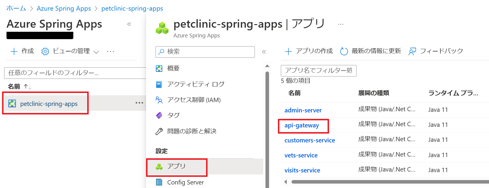

# 演習 3) タスク 1 - ブルーグリーン・デプロイメントのための環境を追加
ブルーグリーン・デプロイメントを実現するため、2 面の環境が必要になります。現在デフォルトの環境以外に、もう 1 面の環境を新規追加します。

この手順は作業を行うターミナルにコマンドで使用する環境変数が設定されている必要があります。

演習1) タスク 2 で使用したターミナルを引き続き使用する場合はそのままでかまいませんが、新しいターミナル画面を使用する場合は、

ローカルのプロジェクト springapps-petclinic-microservices のルートディレクトリを作業ディレクトリとし、以下のコマンドを実行してください。

 \[Bash\]
```
source .scripts/setup-env-variables-azure.sh
```

\[PowerShell\]
```
. .scripts/setup-env-variables-azure.ps1
 ```
## 作業
1. [Azure Spring Apps](https://portal.azure.com/#view/HubsExtension/BrowseResource/resourceType/Microsoft.AppPlatform%2FSpring) のリソース ページを開きます。`アプリ` メニューをクリックします。

    

2. `api-gateway `を選択し、次の画面で`デプロイ`メニューをクリックします。

   実稼働中の default 環境のみが存在することを確認できます。同じ方法でほかのアプリの環境も確認できます。

    

3. 開いたターミナル画面に、Green 環境を作成するため、以下のコマンドを実行します。

    \[Bash\]
    ```
    az spring app deployment create -n production --app ${API_GATEWAY}
    ```

     \[PowerShell\]
    ```
    az spring app deployment create -n production --app $env:API_GATEWAY
    ```

## 確認
1. [Azure Spring Apps](https://portal.azure.com/#view/HubsExtension/BrowseResource/resourceType/Microsoft.AppPlatform%2FSpring) を開き、`アプリ` メニューをクリックします。

    

2. `api-gateway` を選択して、次の画面に`デプロイ`メニューをクリックします。

   実稼働中の default 環境とは別に、`production` 環境が新たに作られたことを確認します。同じ方法で他のアプリの環境も確認できます。

    

## 参照情報
- <a href="https://learn.microsoft.com/ja-jp/azure/spring-apps/overview" target="_blank">Azure Spring Apps の概要</a>
- <a href="https://learn.microsoft.com/ja-jp/azure/spring-apps/concepts-blue-green-deployment-strategies" target="_blank">Azure Spring Apps におけるブルーグリーン デプロイ戦略</a>
- <a href="https://learn.microsoft.com/ja-jp/azure/spring-apps/how-to-staging-environment" target="_blank">Azure Spring Apps でステージング環境を設定</a>

---
次の手順へ: [**タスク 2 - 非稼働環境を確認**](P3-02.md)

前の手順へ: [**演習 2) タスク 5 - CI/CD を体験**](P2-05.md)

READMEへ: [**README**](../README.md#%E6%93%8D%E4%BD%9C%E6%89%8B%E9%A0%86)

