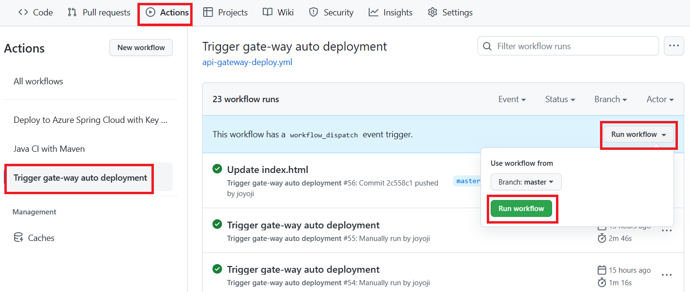

# 演習 3) タスク 2 - 非稼働環境を確認
ブルーグリーン・デプロイメントの準備として、非稼働環境を確認します。

> **注:** 演習作業簡略化のため、ファイルの作成と編集は master ブランチに対して直接行います。

## 作業
1. `.github/workflows/api-gateway-deploy.yml` ファイルを編集モードで開きます。

2. ファイルの末尾にある下記 `step` のコードを削除します。
    ```yaml
        - name: Login with Service SP
          uses: azure/login@v1
          with:
              creds: ${{ secrets.AZURE_CREDENTIALS }}

        - name: Deploy api-gateway
          uses: Azure/spring-cloud-deploy@v1
          with:
              azure-subscription: ${{ env.AZURE_SUBSCRIPTION }}
              action: deploy
              service-name: ${{ env.SPRING_APPS_SERVICE }}
              app-name: ${{ env.API_GATEWAY }}
              use-staging-deployment: false
              package: ${{ github.workspace }}/${{ env.API_GATEWAY_JAR }}
              jvm-options: -Xms1024m -Xmx1024m -Dspring.profiles.active=azure  
    ```

3. 下記の `step` のコードを `.github/workflows/api-gateway-deploy.yml` ファイルの末尾に追加します。  

    ```yaml
        - name: Upload jar file
          uses: actions/upload-artifact@v3
          with:
            name: target-file
            path: ${{ github.workspace }}/${{ env.API_GATEWAY_JAR }} 

      deploy: 
        needs:
        - build
        runs-on: ubuntu-latest      
        steps:
        - name: Login with Service SP
          uses: azure/login@v1
          with:
              creds: ${{ secrets.AZURE_CREDENTIALS }}

        - name: "Get Inactive Side Name"
          id: show-inactive-side     
          uses: Azure/cli@v1
          with:
            inlineScript: |
              az extension add --name spring
              name=$(az spring app deployment list --app ${{ env.API_GATEWAY }} -s ${{ env.SPRING_APPS_SERVICE }} -g ${{ env.RESOURCE_GROUP }} --query "[?properties.active == \`false\`].name" --output tsv)
              echo "deployment-name=$name" >> $GITHUB_OUTPUT
              echo $GITHUB_OUTPUT
    ```
    > **注:**  
    > - インデントに注意してください。  
    > - 変更内容は直接 `master` ブランチにコミットしてください。

    <Br>
    

## 確認
1. [**演習 2) タスク 1 - GitHub Actions 雛形を作成 > 確認 > 2.**](P2-01.md#確認) と同様に、手動実行でワークフローを起動します。
  
    

2. ワークフロー処理がエラーなく終了し、非稼働環境の名前が `deployment-name=production` のように表示されたことを確認します。
  
     <br>

    

## 参照情報
- <a href="https://learn.microsoft.com/ja-jp/azure/spring-apps/overview" target="_blank">Azure Spring Apps の概要</a>
- <a href="https://learn.microsoft.com/ja-jp/azure/spring-apps/concepts-blue-green-deployment-strategies" target="_blank">Azure Spring Apps におけるブルーグリーン デプロイ戦略</a>
- <a href="https://learn.microsoft.com/ja-jp/azure/spring-apps/how-to-staging-environment" target="_blank">Azure Spring Apps でステージング環境を設定</a>


- **GitHub**

    - <a href="https://docs.github.com/en/actions/using-workflows/about-workflows" target="_blank">About workflows</a>
    - <a href="https://docs.github.com/en/actions/using-workflows/triggering-a-workflow" target="_blank">Triggering a workflow</a>
    
---
次の手順へ: [**講習 3) タスク 3 - 非稼働環境へのデプロイジョブを追加**](P3-03.md)

前の手順へ: [**タスク 1 - ブルーグリーン・デプロイメントための環境を追加**](P3-01.md)

READMEへ: [**README**](../README.md#%E6%93%8D%E4%BD%9C%E6%89%8B%E9%A0%86)