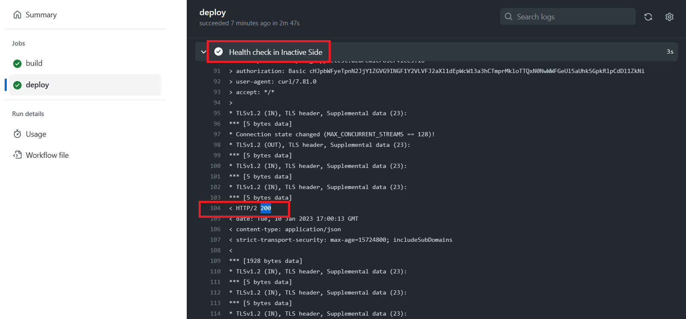

# 演習 3) タスク 3 - 非稼働環境へのデプロイジョブを追加
非稼働環境へのデプロイジョブを追加します。デプロイ後、非稼働環境のエンドポイントに対して疎通テストを実施します。
疎通テストが成功した場合、次のステップでブルーグリーン環境の切替を行います。

> **注:** 演習作業簡略化のため、ファイルの作成と編集は master ブランチに対して直接行います。

## 作業
1. `.github/workflows/api-gateway-deploy.yml` ファイルを編集モードで開きます。

2. 下記の `step` のコードを `.github/workflows/api-gateway-deploy.yml` ファイルの末尾に追加します。

    ```yaml
        - name: Download jar file
          id: download
          uses: actions/download-artifact@v3
          with:
            name: target-file
              
        - name: Deploy to Inactive Side
          id: deploy-to-springapps
          uses: azure/spring-apps-deploy@v1
          with:
            azure-subscription: ${{ env.AZURE_SUBSCRIPTION }}
            action: deploy
            service-name: ${{ env.SPRING_APPS_SERVICE }}
            app-name: ${{ env.API_GATEWAY }}
            deployment-name:  ${{ steps.show-inactive-side.outputs.deployment-name }}
            package: spring-petclinic-api-gateway-2.5.1.jar
            jvm-options: -Xms1024m -Xmx1024m -Dspring.profiles.active=mysql,azure

        - name: Get Endpoint
          id: get-endpoint     
          uses: Azure/cli@v1
          with:
            inlineScript: |
              az extension add --name spring
              echo "app-url=$(az spring test-endpoint list --name ${{ env.SPRING_APPS_SERVICE }} -g ${{ env.RESOURCE_GROUP }} --app ${{ env.API_GATEWAY }} -d  ${{ steps.show-inactive-side.outputs.deployment-name }} --query "[primaryTestEndpoint]" --output tsv)" >> $GITHUB_OUTPUT      

        - name: Health check in Inactive Side
          uses: jtalk/url-health-check-action@v2
          with:
            url: ${{ steps.get-endpoint.outputs.app-url }}api/customer/owners
            follow-redirect: true
            max-attempts: 10
            retry-delay: 10s
            retry-all: true
    ```
    > **注:**  
    > - インデントに注意してください。  
    > - 変更内容は直接 `master` ブランチにコミットしてください。


## 確認
1. [**演習 2) タスク 1 - GitHub Actions 雛形を作成 > 確認 > 2.**](P2-01.md#確認) と同様に、手動実行でワークフローを起動します。
  
    

2. ワークフロー処理はエラーなく終了し、非稼働環境エンドポイントの疎通テストが成功したことを確認します。

    

## 参照情報
- <a href="https://learn.microsoft.com/ja-jp/azure/spring-apps/overview" target="_blank">Azure Spring Apps の概要</a>
- <a href="https://learn.microsoft.com/ja-jp/azure/spring-apps/concepts-blue-green-deployment-strategies" target="_blank">Azure Spring Apps におけるブルーグリーン デプロイ戦略</a>
- <a href="https://learn.microsoft.com/ja-jp/azure/spring-apps/how-to-staging-environment" target="_blank">Azure Spring Apps でステージング環境を設定</a>


- **GitHub**

    - <a href="https://docs.github.com/en/actions/using-workflows/about-workflows" target="_blank">About workflows</a>
    - <a href="https://docs.github.com/en/actions/using-workflows/triggering-a-workflow" target="_blank">Triggering a workflow</a>
    
---
次の手順へ: [**タスク 4 - ブルーグリーン・デプロイメントジョブ追加**](P3-04.md)

前の手順へ: [**タスク 2 - 非稼働環境を確認**](P3-02.md)

READMEへ: [**README**](../README.md#%E6%93%8D%E4%BD%9C%E6%89%8B%E9%A0%86)
