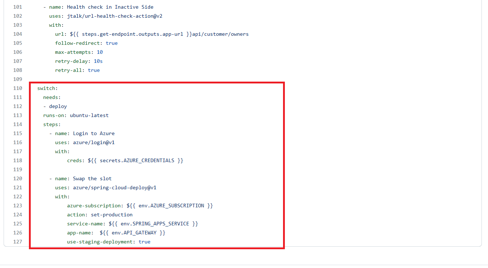
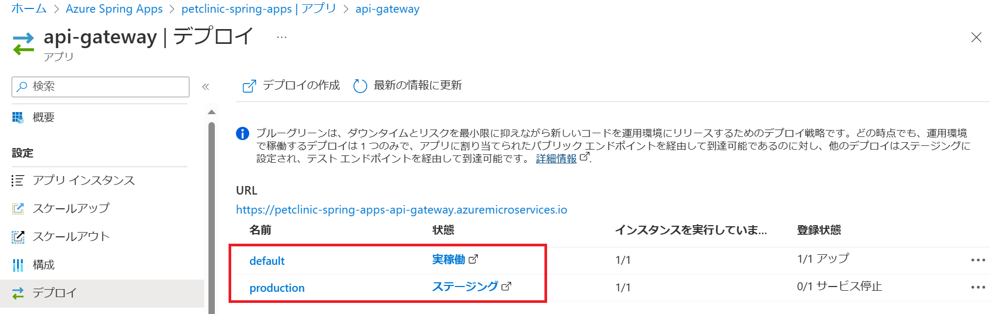
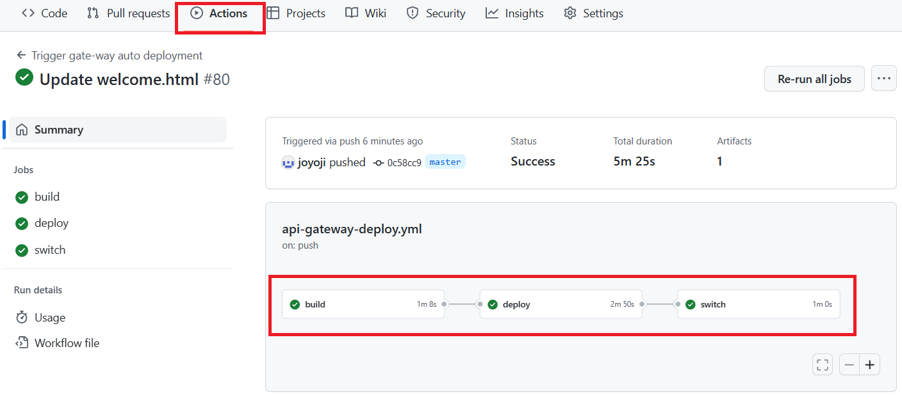
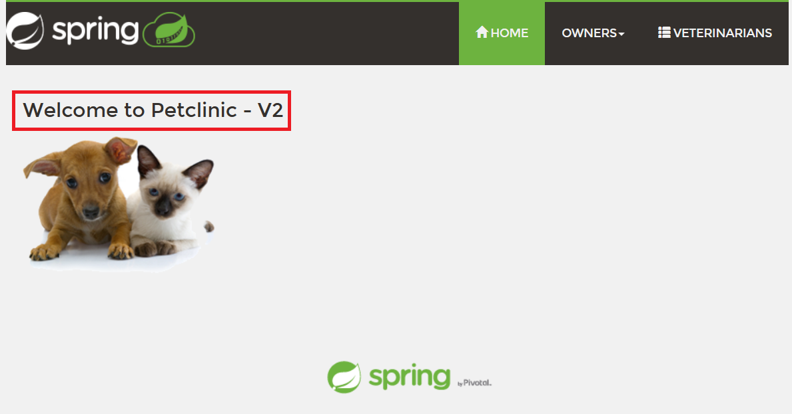

# 演習 3) タスク 4 - ブルーグリーン・デプロイメントジョブ追加
ブルーグリーン・デプロイメントジョブ追加します。

> **注:** 演習作業簡略化のため、ファイルの作成と編集は master ブランチに対して直接行います。

## 作業
1. `.github/workflows/build-deploy.yml` ファイルを編集モードで開きます。

2. 下記の `step` のコードを `.github/workflows/api-gateway-deploy.yml` ファイルの末尾に追加します。
```yaml
  switch:    
    needs:
    - deploy
    runs-on: ubuntu-latest
    steps:
      - name: Login to Azure
        uses: azure/login@v1
        with:
            creds: ${{ secrets.AZURE_CREDENTIALS }}

      - name: Swap the slot
        uses: azure/spring-cloud-deploy@v1
        with:
            azure-subscription: ${{ env.AZURE_SUBSCRIPTION }}
            action: set-production
            service-name: ${{ env.SPRING_APPS_SERVICE }}
            app-name:  ${{ env.API_GATEWAY }}
            use-staging-deployment: true
```
> **注:**  
> - インデントに注意してください。  
> - 変更内容は直接 `main` ブランチにコミットしてください。

## ブルーグリーン・デプロイメント前の確認
3. 上記 2. の修正が下図赤枠のように `.github/workflows/api-gateway-deploy.yml` ファイルに反映されていることを確認します。
  
    


4. [Spring Apps](https://portal.azure.com/#view/HubsExtension/BrowseResource/resourceType/Microsoft.AppPlatform%2FSpring) を開きます、`アプリ` メニューをクリックします。

    

5. `api-gateway` を選択して、次の画面に`デプロイ`メニューをクリックします。下記の情報を確認します。

   実稼働中環境: default

   ステージング環境: production
   
   

6. アプリの URL にアクセスして、タイトルに V1 が入っていることを確認します。

    

7.  API アプリの リポジトリの `springapps-petclinic-microservices/spring-petclinic-api-gateway/src/main/resources/static/scripts/fragments/welcome.html` にメッセージを更新し、`main` ブランチにコミットします。 <br>

    修正前: Welcome to Petclinic - V1

    修正後: Welcome to Petclinic - V2

    

8. ワークフロー処理が自動的に起動されていることを確認します。

    

<br>

## ブルーグリーン・デプロイメント後の確認
9. ワークフロー処理がエラーなく終了したことを確認します。

     <br>

    

4. [Spring Apps](https://portal.azure.com/#view/HubsExtension/BrowseResource/resourceType/Microsoft.AppPlatform%2FSpring) を開きます、`アプリ` メニューをクリックします。

    

5. `api-gateway` を選択して、次の画面に`デプロイ`メニューをクリックします。下記の情報を確認します。

   実稼働中環境: production

   ステージング環境: default
   
   

6. アプリの `URL` にアクセスして、タイトルに V2 が入っていることを確認します。

    

## 参照情報

- <a href="https://learn.microsoft.com/ja-jp/azure/spring-apps/overview" target="_blank">Azure Spring Apps の概要</a>
- <a href="https://learn.microsoft.com/ja-jp/azure/spring-apps/concepts-blue-green-deployment-strategies" target="_blank">Azure Spring Apps におけるブルーグリーン デプロイ戦略</a>
- <a href="https://learn.microsoft.com/ja-jp/azure/spring-apps/how-to-staging-environment" target="_blank">Azure Spring Apps でステージング環境を設定</a>


- **GitHub**

    - <a href="https://docs.github.com/en/actions/using-workflows/about-workflows" target="_blank">About workflows</a>
    - <a href="https://docs.github.com/en/actions/using-workflows/triggering-a-workflow" target="_blank">Triggering a workflow</a>
    
---
次の手順へ: [**演習 4) タスク 1 - 監視の設定**](P4-01.md)

前の手順へ: [**タスク 3 - 非稼働環境へのデプロイジョブを追加**](P3-03.md)

READMEへ: [**README**](../README.md#%E6%93%8D%E4%BD%9C%E6%89%8B%E9%A0%86)
