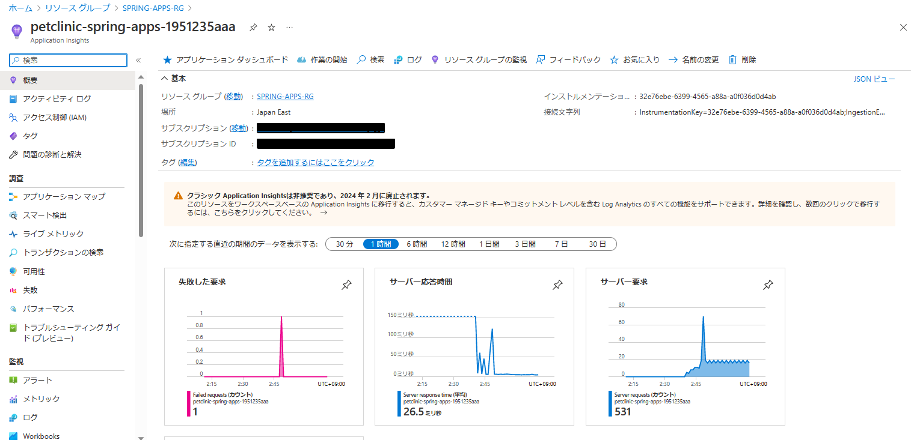

# 演習 4) タスク 1 - 監視の設定
Azure Spring Apps 上で動作するアプリケーションを監視するため、Azure Monitor のコンポーネントである Application Insights を使用します。

Azure Spring Apps リソースを作成した際に、Application Insights は自動的に作成されましたので。新規作る作業は不要となります。
## 確認
1. [リソース グループ](https://portal.azure.com/?feature.customportal=false#view/HubsExtension/BrowseResourceGroups) ページを開きます。対象の `リソース グループ` を選択します。

    

2. リソース一覧ページに、Azure Spring Apps サービス名と同じの Application Ingishgts が存在していることを確認します。

    `Application Ingishgts` のリソースを選択します。

    

3. Application Ingishgts の画面が表示されることを確認します。

    

## 参照情報
- <a href="https://learn.microsoft.com/ja-jp/azure/spring-apps/diagnostic-services" target="_blank">Azure Spring Apps ログとメトリックの分析</a>
- <a href="https://learn.microsoft.com/ja-jp/azure/spring-apps/how-to-application-insights?pivots=sc-standard-tier" target="_blank">Azure Spring Apps Java インプロセス エージェントを使用した Application Insights</a>
- <a href="https://learn.microsoft.com/ja-jp/azure/azure-monitor/app/app-map" target="_blank">アプリケーション マップ</a>
- <a href="https://learn.microsoft.com/ja-jp/azure/azure-monitor/app/live-stream" target="_blank">ライブ メトリック : 1 秒の待機時間での監視と診断</a>
- <a href="https://learn.microsoft.com/ja-jp/azure/azure-monitor/app/tutorial-performance" target="_blank">Application Insights を使用してパフォーマンスに関する問題を検出</a>
- <a href="https://learn.microsoft.com/ja-jp/azure/azure-monitor/app/tutorial-runtime-exceptions" target="_blank">Azure Application Insights でランタイムの例外を見つける</a>
- <a href="https://learn.microsoft.com/ja-jp/azure/azure-monitor/essentials/tutorial-metrics" target="_blank">Azure リソースのメトリックを分析する</a>
- <a href="https://learn.microsoft.com/ja-jp/azure/azure-monitor/logs/data-platform-logs" target="_blank">Azure Monitor ログの概要</a>
---
次の手順へ: [**タスク 2 - トラフィックの作成**](P4-02.md)

前の手順へ: [**演習 3) タスク 4 - ブルーグリーン・デプロイメントジョブ追加**](P3-04.md)

READMEへ: [**README**](../README.md#%E6%93%8D%E4%BD%9C%E6%89%8B%E9%A0%86) 

