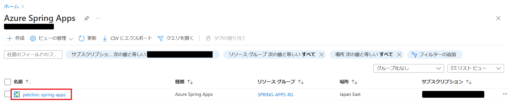
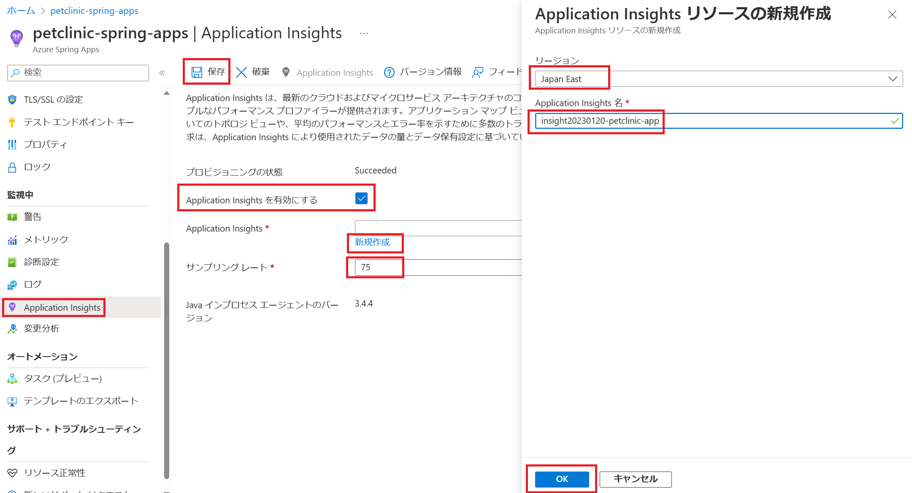

# 演習 4) タスク 1 - 監視の設定

## 作業
1. 対象の Spring Apps を選択して、次の画面に アプリ メニューを押下します。

    

2. 下記の設定を行ったうえで、保存ボタンをクリックします。

    - Application Insights を有効にする: チックを入れる

    - Application Insights: 新規作成リンクをクリックして、右側の Application Insights リソースの新規作成画面に詳細を設定し、OK ボタンを押下

        リージョン: Japan East  
        Application Insights 名: insight20230120-petclinic-app

    - サンプリング レート: 75

    

## 確認
3. Application Ingishgts が作成されます。Application Ingishgts ボタンをクリックしてアクセスします。

    

4. Application Ingishgts の画面が表示されることを確認します。

    

---
次の手順へ: [**タスク 2 - トラフィックの作成**](P4-02.md)

前の手順へ: [**演習 3) タスク 4 - ブルーグリーン・デプロイメントジョブ追加**](P3-04.md)

READMEへ: [**README**](../README.md#%E6%93%8D%E4%BD%9C%E6%89%8B%E9%A0%86) 

