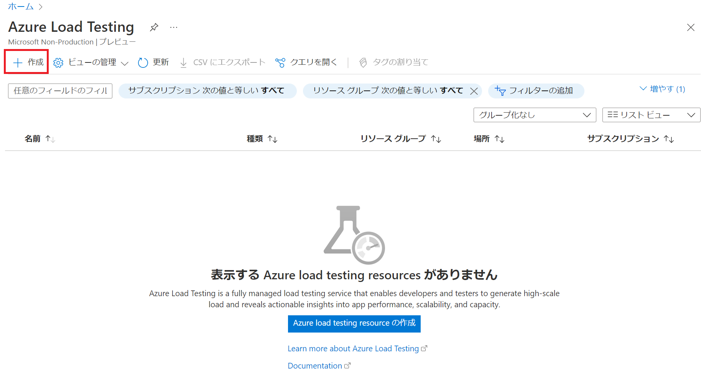
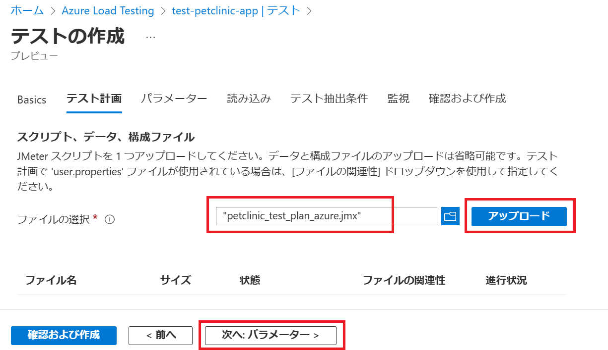

演習 4) タスク 1 - トラフィックの作成

# トラフィックの作成
監視データを観測しやすくため、継続でアプリのエンドポイントへアクセスさせます。
アプリは複数のマイクロサービスで構成されています、Azure Load Testing サービスでトラフィックを生成します。

1. Azure Load Testing のリソースを作成します
    以下のリンクへアクセス、作成ボタンをクリックします
    https://portal.azure.com/#view/HubsExtension/BrowseResource/resourceType/Microsoft.LoadTestService%2FLoadTests

    

    必須項目を入力します。Review + create ボタンを押下します

        

2. テストプランを新規追加します。
    作成済みのリソースを表示します。Tests ページの　Upload a JMeter script をクリックします。

    

    Basic 情報を入力します。

    

    ローカルの Jmeter プランファイル (*.jmx) を選択して、Upload ボタンを押下し、アップロードします
    springapps-petclinic-microservices\spring-petclinic-api-gateway\src\test\jmeter\petclinic_test_plan_azure.jmx

    

    パラメーターとして以下の環境変数を定義します。     

    PETCLINC_HOST: アクセス先のURLとなります、https抜きの部分を入力  
    RUN_INTERVAL: 単位が秒である、実行期間となります、デフォルトで 300 を入力  
     
        

    Review + create ボタンを押下します
    
       

3. テストプランを表示し、Run をクリックします、デフォルトの設定値で Run ボタンを押下します

       

4. 実行中の項目をクリックして、詳細を確認します。

       

---
次の手順へ: [**タスク 2 - アプリのコンパイルジョブ追加**](P4-02.md)

前の手順へ: [**講習 3) タスク 4 - CI/CD を体験**](P3-04.md)

READMEへ: [**README**](../README.md#%E6%93%8D%E4%BD%9C%E6%89%8B%E9%A0%86) 

