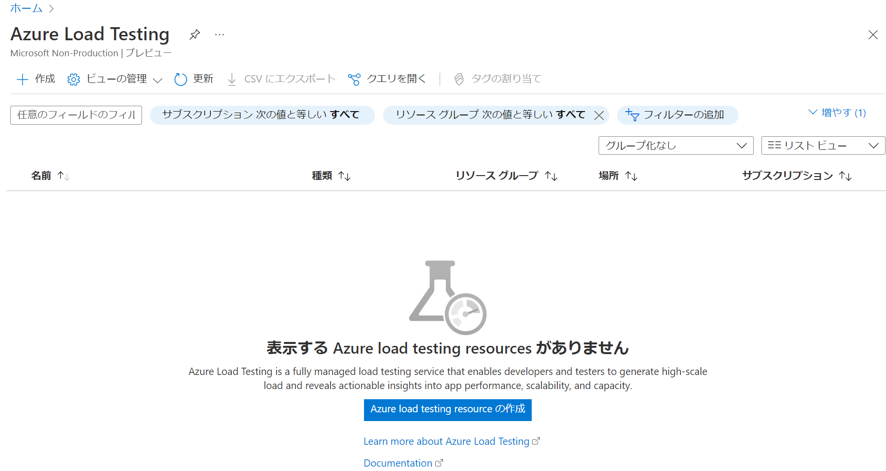
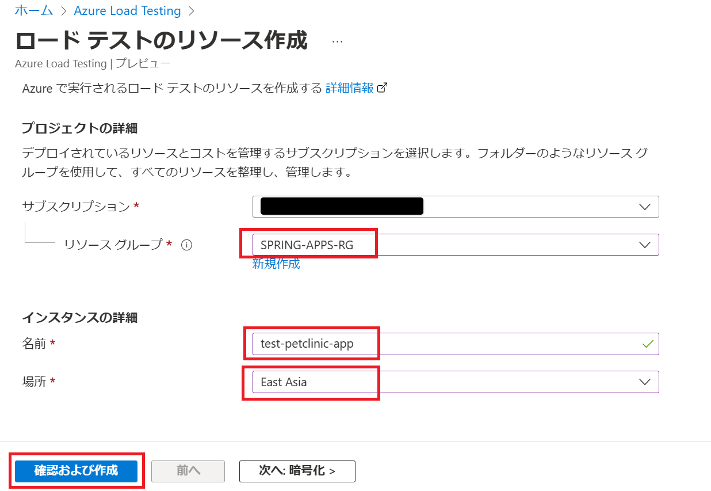
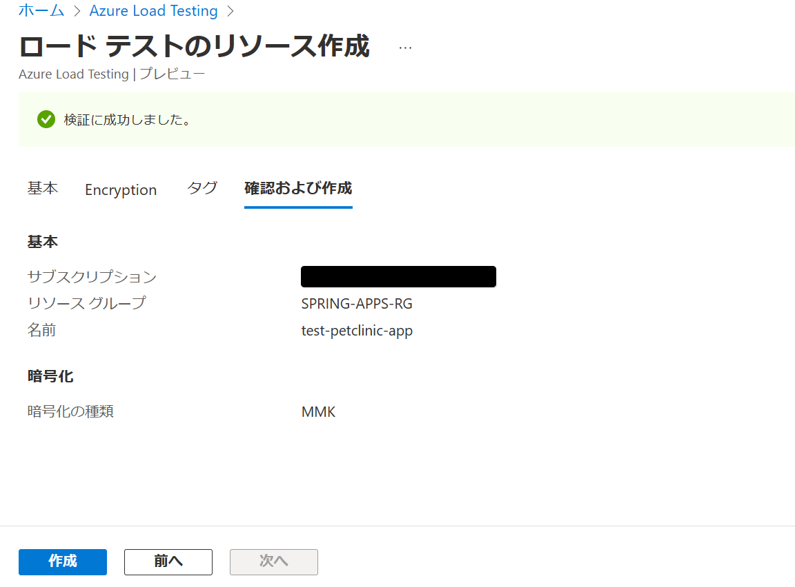
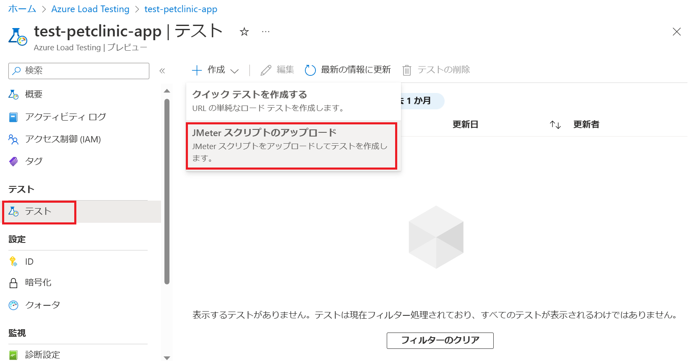
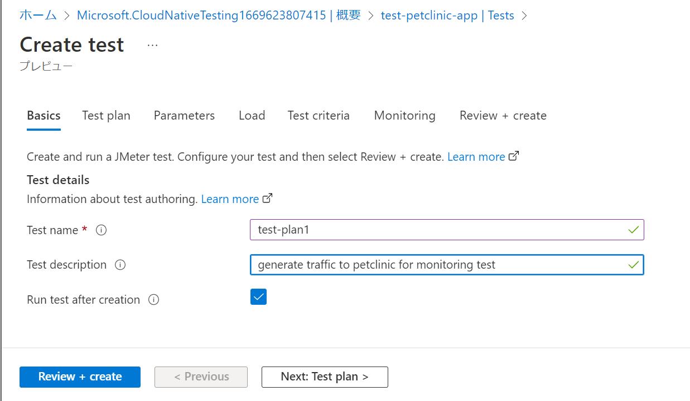
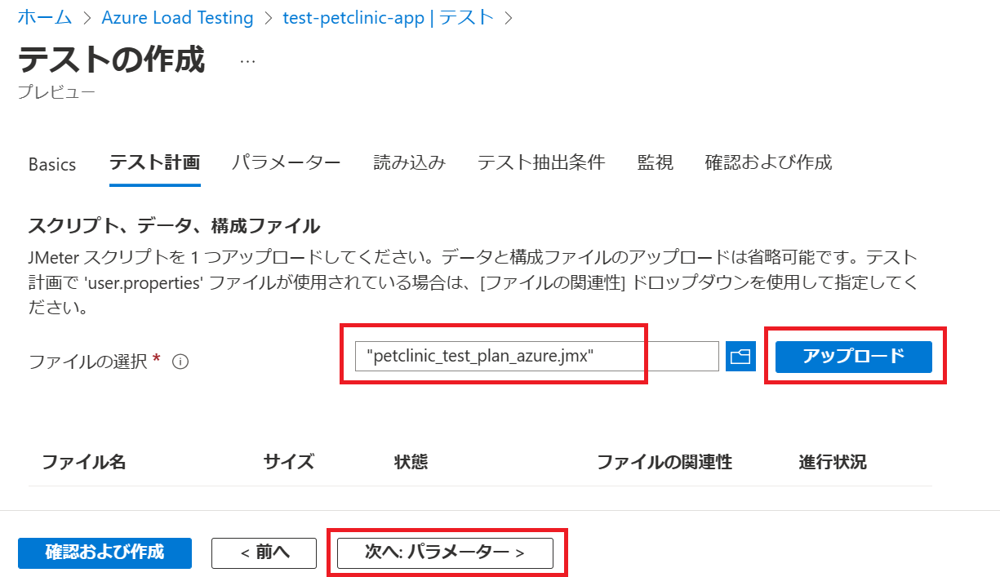
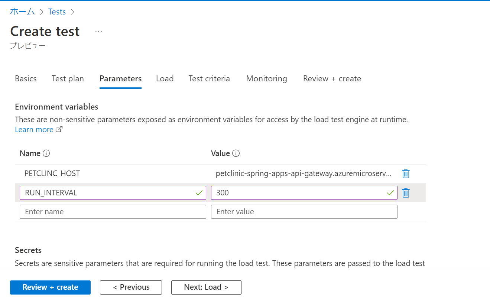
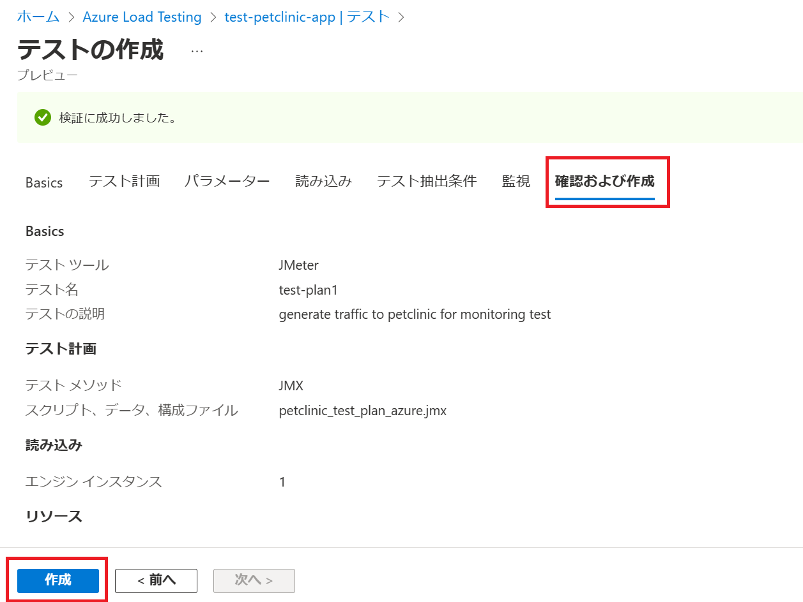
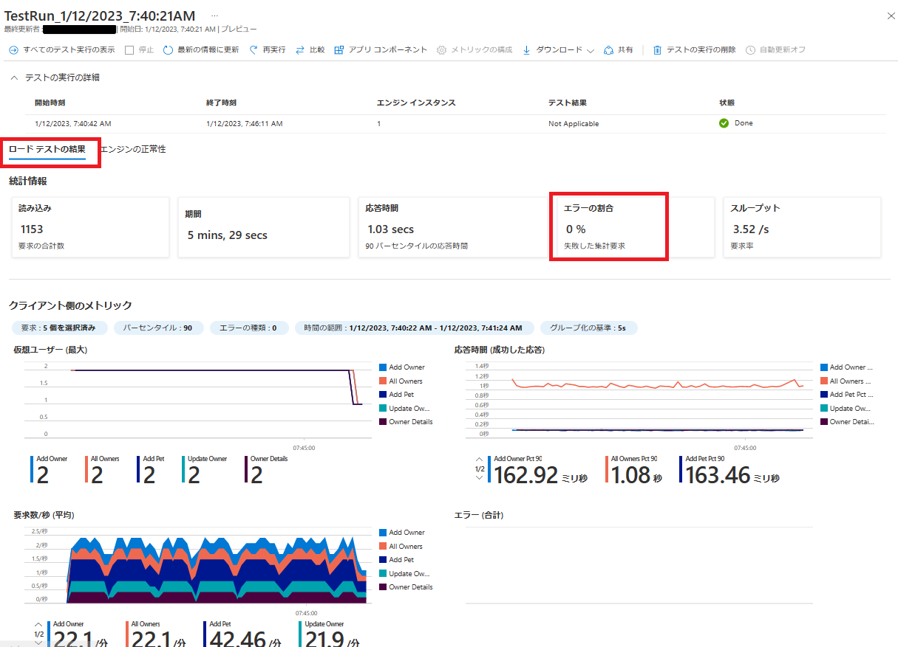

# 演習 4) タスク 2 - トラフィックの作成
監視データを観測しやすくため、継続でアプリのエンドポイントへアクセスさせます。
アプリは複数のマイクロサービスで構成されています、Azure Load Testing サービスでトラフィックを生成します。
# 作業
1. 下記のリンクへアクセス、`作成`ボタンをクリックします。
    https://portal.azure.com/#view/HubsExtension/BrowseResource/resourceType/Microsoft.LoadTestService%2FLoadTests

    

    必須項目を入力します。`確認後および作成`ボタンを押下します。

        

    確認された後、`作成`ボタンをクリックします。

     

2. `テスト`メニューを選択します。`作成`をクリックし、`JMeter スクリプトのアップロード`を選択します。

    

    Basic 情報を入力します。`次へ: テスト計画`をクリックします。

    

    ローカルの Jmeter プランファイル (*.jmx) を選択して、`アップロード`ボタンを押下します。

    パス: springapps-petclinic-microservices\spring-petclinic-api-gateway\src\test\jmeter\petclinic_test_plan_azure.jmx

    

    `次へ: パラメーター`ボタンをクリックします。
    パラメーターとして以下の環境変数を定義します。     

    PETCLINC_HOST: [**タスク 4 - Azure CLI を使用した Azure Spring Apps のデプロイ**](P1-04.md)の動作確認に記録した URL の 
https 抜きの部分を入力

    RUN_INTERVAL: 秒単位の実行期間となり、デフォルトで 300 を入力  
     
        

    `確認及び作成`ボタンを押下します。
    
       

3. 作成後、テストプランは自動的に実行されます。

4. `実行中の項目`をクリックして、詳細を確認します。

       

## 参照情報
- <a href="https://learn.microsoft.com/ja-jp/azure/load-testing/overview-what-is-azure-load-testing
" target="_blank">Azure Load Testing とは</a>
- <a href="https://learn.microsoft.com/ja-jp/azure/load-testing/quickstart-create-and-run-load-test
" target="_blank">Azure Load Testing の作成及び実行</a>
- <a href="https://learn.microsoft.com/ja-jp/azure/load-testing/how-to-parameterize-load-tests
" target="_blank">Azure Load Testing のパラメーター化</a>
- <a href="https://learn.microsoft.com/ja-jp/azure/load-testing/how-to-create-and-run-load-test-with-jmeter-script
" target="_blank">JMeter スクリプトを使用してロード テストを作成</a>

---
次の手順へ: [**タスク 3 - アプリの監視**](P4-03.md)

前の手順へ: [**タスク 1 - 監視の設定**](P4-01.md)

READMEへ: [**README**](../README.md#%E6%93%8D%E4%BD%9C%E6%89%8B%E9%A0%86) 

