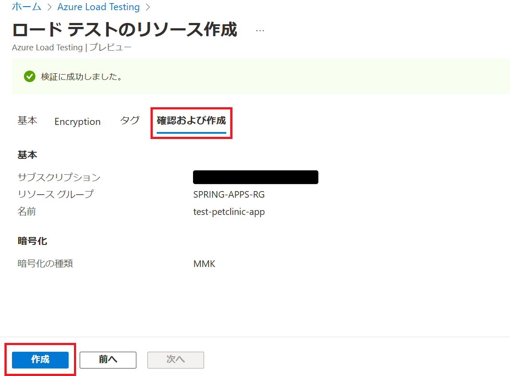
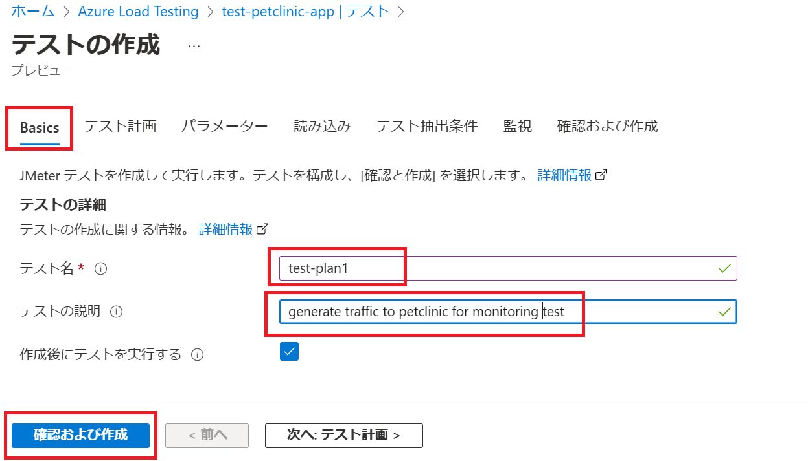

# 演習 4) タスク 2 - トラフィックの作成

# トラフィックの作成
監視データを観測しやすくため、継続でアプリのエンドポイントへアクセスさせます。
アプリは複数のマイクロサービスで構成されています、Azure Load Testing サービスでトラフィックを生成します。

1. Azure Load Testing のリソースを作成します
    以下のリンクへアクセス、作成ボタンをクリックします
    https://portal.azure.com/#view/HubsExtension/BrowseResource/resourceType/Microsoft.LoadTestService%2FLoadTests

    

    必須項目を入力します。確認後および作成 ボタンを押下します

        

    確認された後、作成ボタンをクリックします。

     

2. テストプランを新規追加します。
    作成済みのリソースを表示します。Tests ページの JMeter スクリプトのアップロード ボタンをクリックします。

    

    Basic 情報を入力します。次へ: テスト計画 をクリックします。

    

    ローカルの Jmeter プランファイル (*.jmx) を選択して、アップロード ボタンを押下し、アップロードします。
    springapps-petclinic-microservices\spring-petclinic-api-gateway\src\test\jmeter\petclinic_test_plan_azure.jmx

    

    それから、次へ: パラメーター ボタンをクリックします。
    パラメーターとして以下の環境変数を定義します。     

    PETCLINC_HOST: アクセス先のURLとなります、https抜きの部分を入力  
    RUN_INTERVAL: 単位が秒である、実行期間となります、デフォルトで 300 を入力  
     
        

   確認及び作成 ボタンを押下します。
    
       

3. 作成後、テストプランは自動的に稼働し始めます。

   2回目以降実施の場合、テストプランを表示し、Run をクリックします、デフォルトの設定値で Run ボタンを押下します

       

4. 実行中の項目をクリックして、詳細を確認します。

       

---
次の手順へ: [**タスク 3 - アプリの監視**](P4-03.md)

前の手順へ: [**タスク 1 - 監視の設定**](P4-01.md)

READMEへ: [**README**](../README.md#%E6%93%8D%E4%BD%9C%E6%89%8B%E9%A0%86) 

