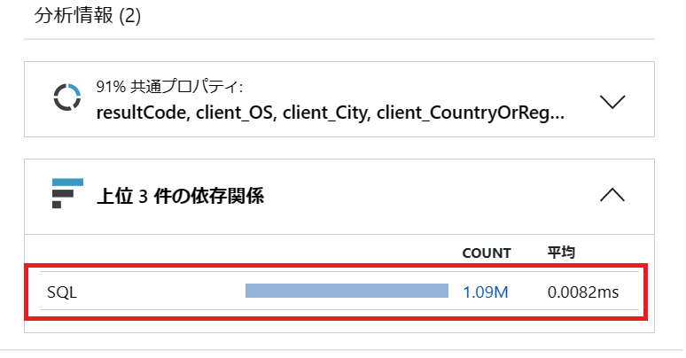
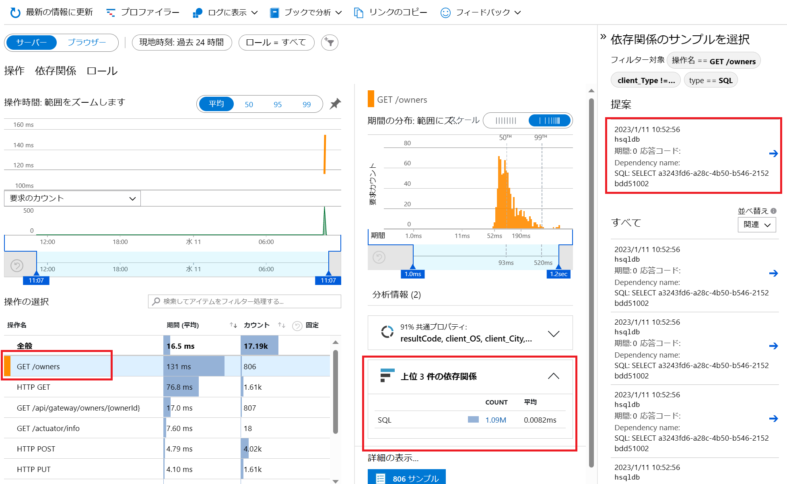

# 演習 4) タスク 3 - アプリの監視

## アプリケーション マップ
1. ポータルサイトの監視ツール Application Insight へアクセスします

    https://portal.azure.com/#view/HubsExtension/BrowseResource/resourceType/microsoft.insights%2Fcomponents

2. 対象の監視対象を選択します。次の画面に左側のメニューに「アプリケーション マップ」をクリックします

    全てのコンポーネントおよび依存関係が表示されます。サービスのトポロジーを可視化にできます。
    いずれかのコンポーネントを選ぶと、関連する分析情報を表示したり、そのコンポーネントについてのパフォーマンスと障害のトリアージ機能にアクセスしたりすることができます。

    

    対象のアプリの丸をクリックして、平均レスポンス時間が表示されます。    
    
 

## パフォーマンス
1. Application Insight ページの左側メニューに「パフォーマンス」をクリックします。

    

    さらにリクエストと依存関係のあるデータベースのアクセスタイムも確認できます。

    データベースへのアクセスがあるリクエスト Get /owners を選択して、右側の上位 3 件の依存関係をクリックします。

    データベース のアクセスう件数および平均レスポンスタイムが表示されます。

     

    件数をクリックすると、右側にトランザクションのリストが表示されます。

2. 上記のトランザクションをクリックすると、各トランザクションの詳細が表示されます。    

        

 

## サービスのリアルタイム監視
1. Application Insight ページの左側メニューに「ライブ メトリック」をクリックします。

    Incoming Requests / Outgoing Requests および各サービスの失敗リクエスト数・CPU・メモリなどの情報はリアルタイムで表示されます。

       

---
次の手順へ: [**タスク 4 - ログのリアルタイム監視**](P4-04.md)

前の手順へ: [**タスク 2 - トラフィックの作成**](P4-02.md)

READMEへ: [**README**](../README.md#%E6%93%8D%E4%BD%9C%E6%89%8B%E9%A0%86) 