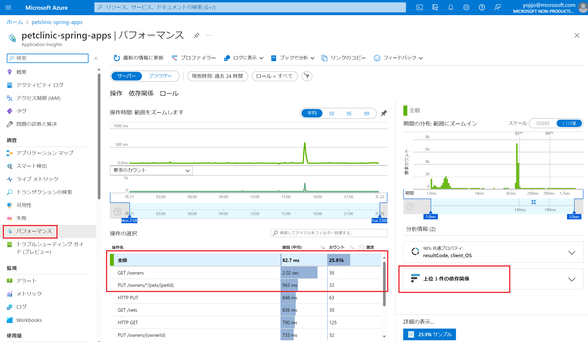

# 演習 4) タスク 3 - アプリの監視

## アプリケーション マップ
1. Azure Portal の監視ツール `Application Insight` へアクセスします。

    https://portal.azure.com/#view/HubsExtension/BrowseResource/resourceType/microsoft.insights%2Fcomponents

2. `監視対象`を選択します。次の画面に左側のメニューに`アプリケーション マップ`をクリックします。

    全てのコンポーネントおよび依存関係が表示されます。サービスのトポロジーを可視化にできます。
    いずれかのコンポーネントを選ぶと、関連する分析情報を表示したり、そのコンポーネントについてのパフォーマンスと障害のトリアージ機能にアクセスしたりすることができます。

    

    `対象のアプリの丸`をクリックすると、平均レスポンス時間が表示されます。    
    
 

## パフォーマンス
1. Application Insight ページの左側メニューに`パフォーマンス`をクリックします。

    

    さらにリクエストと依存関係のあるデータベースのアクセスタイムも確認できます。

    データベースへのアクセスがあるリクエスト `Get /owners` を選択して、右側の`上位 3 件の依存関係`をクリックします。

    データベース のアクセスう件数および平均レスポンスタイムが表示されます。

     

    `件数`をクリックすると、右側にトランザクションのリストが表示されます。

2. 上記の`トランザクション`をクリックすると、各トランザクションの詳細が表示されます。    

        

 

## サービスのリアルタイム監視
1. Application Insight ページの左側メニューに`ライブ メトリック`をクリックします。

    Incoming Requests / Outgoing Requests および各サービスの失敗リクエスト数・CPU・メモリなどの情報はリアルタイムで表示されます。

       

## 参照情報
- <a href="https://learn.microsoft.com/ja-jp/azure/spring-apps/diagnostic-services
" target="_blank">Azure Spring Apps ログとメトリックの分析</a>
- <a href="https://learn.microsoft.com/ja-jp/azure/spring-apps/how-to-application-insights?pivots=sc-standard-tier
" target="_blank">Azure Spring Apps Java インプロセス エージェントを使用した Application Insights</a>
- <a href="　https://learn.microsoft.com/ja-jp/azure/azure-monitor/app/app-map
" target="_blank">アプリケーション マップ</a>
- <a href="　https://learn.microsoft.com/ja-jp/azure/azure-monitor/app/live-stream
" target="_blank">ライブ メトリック : 1 秒の待機時間での監視と診断</a>
- <a href="https://learn.microsoft.com/ja-jp/azure/azure-monitor/app/tutorial-performance
" target="_blank">Application Insights を使用してパフォーマンスに関する問題を検出</a>
- <a href="https://learn.microsoft.com/ja-jp/azure/azure-monitor/app/tutorial-runtime-exceptions
" target="_blank">Azure Application Insights でランタイムの例外を見つける</a>
- <a href="https://learn.microsoft.com/ja-jp/azure/azure-monitor/essentials/tutorial-metrics
" target="_blank">Azure リソースのメトリックを分析する</a>
- <a href="https://learn.microsoft.com/ja-jp/azure/azure-monitor/logs/data-platform-logs
" target="_blank">Azure Monitor ログの概要</a>

---
次の手順へ: [**タスク 4 - ログのリアルタイム監視**](P4-04.md)

前の手順へ: [**タスク 2 - トラフィックの作成**](P4-02.md)

READMEへ: [**README**](../README.md#%E6%93%8D%E4%BD%9C%E6%89%8B%E9%A0%86) 