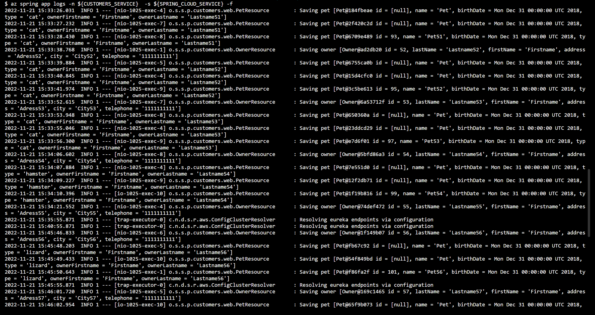

# 演習 4) タスク 4 - ログのリアルタイム監視
トラブルシューティング目的でリアルタイムにアプリケーション コンソール ログを取得するために、Azure CLI でログ ストリーミングにする方法を説明します。

## 作業
1. Git Bash ターミナル画面を開きます、プロジェクト `Azure Spring Apps` へ移動します。
    ```bash
    cd ${Project_Path}
    source .scripts/setup-env-variables-azure.sh
    ```

2. 下記のコマンドを実行します。
    ```bash
    # -f は --follow の略となり、ログをストリーミングするかどうかを指定します。
    az spring app logs -n ${API_GATEWAY}  -s ${SPRING_APPS_SERVICE} -f
    ```
    <b>

    対象サービスのログがリアルタイムで出力されます。ほかのサービスも下記のコマンドを使ってログを確認できます。
    ```bash
    az spring app logs -n ${CUSTOMERS_SERVICE}  -s ${SPRING_APPS_SERVICE} -f

    az spring app logs -n ${VISITS_SERVICE}  -s ${SPRING_APPS_SERVICE} -f

    az spring app logs -n ${VETS_SERVICE}  -s ${SPRING_APPS_SERVICE} -f

    az spring app logs -n ${ADMIN_SERVER}  -s ${SPRING_APPS_SERVICE} -f        
    ```
    
       

## 参照情報
- <a href="https://learn.microsoft.com/ja-jp/azure/spring-apps/how-to-log-streaming
" target="_blank">Azure Spring Apps のアプリケーション コンソール ログをリアルタイムでストリーミングする</a>
- <a href="https://learn.microsoft.com/ja-jp/cli/azure/spring/app?view=azure-cli-latest#az-spring-app-logs
" target="_blank">az spring app logs</a>


---
次の手順へ: [**演習 5) タスク 1 - 自動スケーリングの条件を定義**](P5-01.md)

前の手順へ: [**タスク 3 - アプリの監視**](P4-03.md)

READMEへ: [**README**](../README.md#%E6%93%8D%E4%BD%9C%E6%89%8B%E9%A0%86) 