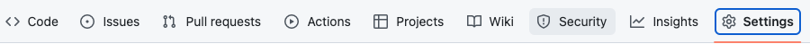
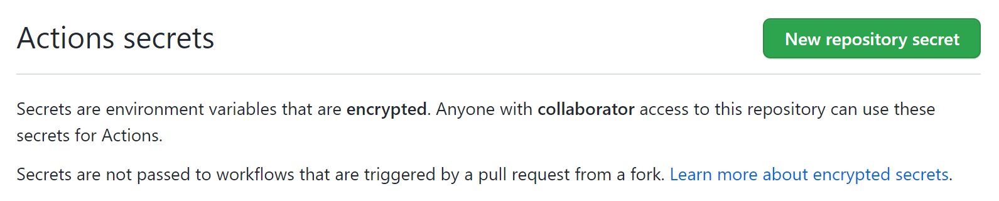
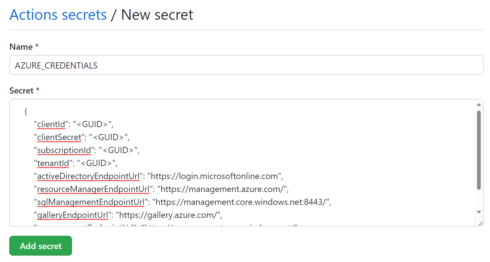
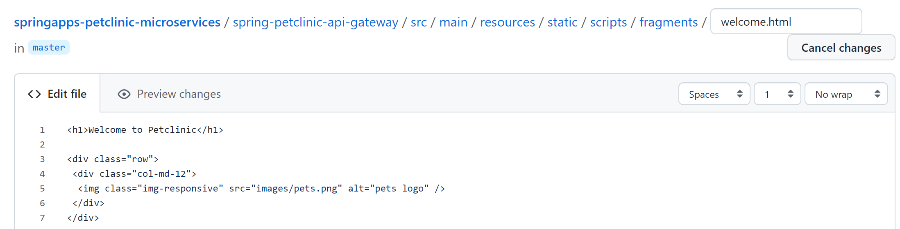
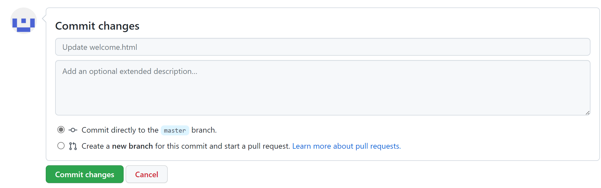
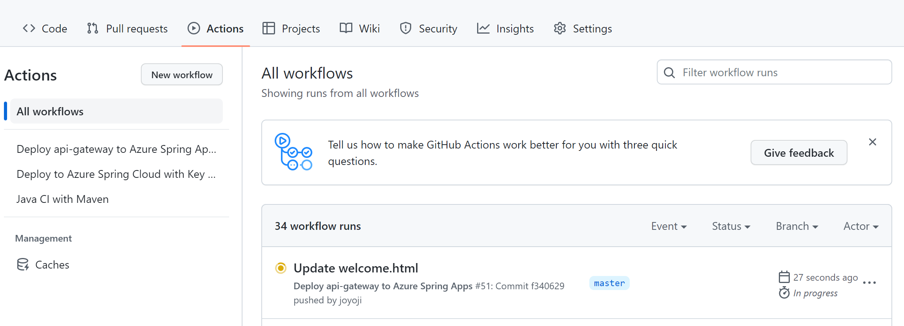
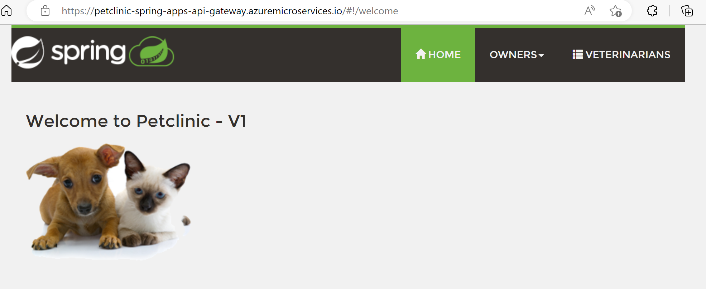
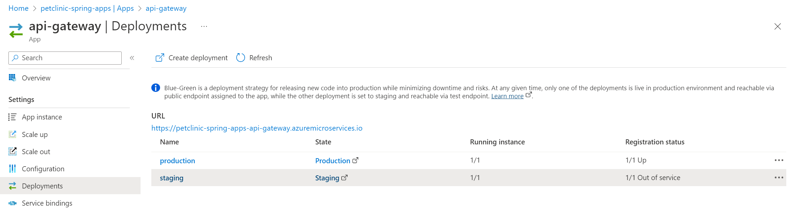

演習 1) タスク 2 - Blue/Green リリースの実施

Azure Spring Apps でブルーグリーン デプロイ パターンをサポートしています。

ブルーグリーン デプロイとは、新しい (グリーン) バージョンのデプロイ中に、既存 (ブルー) のバージョンを実行状態のまま保持できます。ブルーグリーン切替の前に、新しいバージョンをテストできるメリットがあります、また、切替後、もし不具合が見つかりましたら、ロールバック操作より迅速に古いバージョンに戻すこともできます。

ブルーグリーン デプロイはポータルサイトの UI 操作または Azure CLI、PowerShell、Gihub Action などで実現できます。
本ハンズオンは、Gihub Actions で CI/CD Worflow を試してみます。

GitHub Actions より Azure リソースをデプロイするため、Azure 側と GitHub 側の認証関連の設定を行います。そして、 GitHub アクションに Azure への Login 処理を追加します。
注: 演習作業簡略化のため、ファイルの作成と編集は main ブランチに対して直接行います。

# Azure Active Directory のアプリケーションおよびサービス プリンシパルの作成
3.  Azure AD アプリの作成、 IAM 設定、Secrets の設定を行います。

    ```bash
    export MSYS_NO_PATHCONV=1 
    az ad sp create-for-rbac --role contributor --scopes /subscriptions/${SUBSCRIPTION} --sdk-auth
    ```

    新しく作成されたサービス プリンシパルは以下の通り出力されます。メモに記録しておきます。
    {
        "clientId": "<GUID>",
        "clientSecret": "<GUID>",
        "subscriptionId": "<GUID>",
        "tenantId": "<GUID>",
        "activeDirectoryEndpointUrl": "https://login.microsoftonline.com",
        "resourceManagerEndpointUrl": "https://management.azure.com/",
        "sqlManagementEndpointUrl": "https://management.core.windows.net:8443/",
        "galleryEndpointUrl": "https://gallery.azure.com/",
        "managementEndpointUrl": "https://management.core.windows.net/"
    }

# GitHub シークレットの作成
1. GitHub シークレットを作成するため、GitHub リポジトリを開き、 [Settings](設定) に移動します。

    

2.  セキュリティ > シークレットと変数 > ] [アクション] の順に選択します。

    

3. New repository secret ボタンをクリックして、シークレットを新規作成します。    

    

4. 以下の通り入力したら、Add secret ボタンを押下します

    GitHub シークレット名: AZURE_CREDENTIALS 

    シークレット値: 上記出力されたサービス プリンシパル

    

# Github ワークフローの作成と実行（デプロイ）
1. GitHub リポジトリにて新規ファイルを作成します。

2. 下記コードをコピーして、 .github/workflows/api-gateway-deploy.yml として作成します。
```yaml
name: Deploy api-gateway to Azure Spring Apps
on:
workflow_dispatch:
push:
    branches:
    - master
    paths:
    - 'spring-petclinic-api-gateway/**'
    
env:
AZURE_SUBSCRIPTION: c1d1be4e-2f5c-4bbc-ab97-a8e17b4b3cc6 # customize this
SPRING_APPS_SERVICE: petclinic-spring-apps # customize this
KEYVAULT: spring-apps-vault # customize this
# ==== APPS ====:
API_GATEWAY: api-gateway
# ==== JARS ====:
API_GATEWAY_JAR: spring-petclinic-api-gateway/target/spring-petclinic-api-gateway-2.5.1.jar

jobs:
    build:
    runs-on: ubuntu-latest
    steps:
    - name: Login with Service SP
    uses: azure/login@v1
    with:
        creds: ${{ secrets.AZURE_CREDENTIALS }}
        
    - name: Checkout your repo
    uses: actions/checkout@v2
    
    - name: Set up JDK 11
    uses: actions/setup-java@v2
    with:
        java-version: '11'
        distribution: 'adopt'
        cache: maven

    - name: maven build, clean
    run: |
        mvn clean package -DskipTests -Denv=cloud
    
    - name: Deploy api-gateway
    uses: Azure/spring-cloud-deploy@v1
    with:
        azure-subscription: ${{ env.AZURE_SUBSCRIPTION }}
        action: deploy
        service-name: ${{ env.SPRING_APPS_SERVICE }}
        app-name: ${{ env.API_GATEWAY }}
        use-staging-deployment: false
        package: ${{ github.workspace }}/${{ env.API_GATEWAY_JAR }}
        jvm-options: -Xms2048m -Xmx2048m -Dspring.profiles.active=mysql,azure

```
    > **注:**  
    > - インデントを注意してください。  
    > -  変更内容は直接 `main` ブランチにコミットしてください。
    
3. api-gateway-deploy.yml ファイルが正常に作成されていることを確認します。

4. Actionsタブにて、対象ワークフローTrigger auto deploymentを選択し、Run workflowメニューからRun workflowボタンをクリックし、手動実行でワークフローを起動します。

5. ワークフロー処理はエラーなく終了し、build ジョブのログにリポジトリ名が出力されていることを確認します。

# Github ワークフローの作成と実行（ Blue / Green デプロイ）
1. GitHub リポジトリにて上記のファイルを編集します。

2. 下記コードをコピーして、 .github/workflows/api-gateway-deploy.yml を上書きします。
    
```yaml
name: Deploy api-gateway to Azure Spring Apps
on:
  push:
    branches:
      - master
    paths:
      - "spring-petclinic-api-gateway/**"
  workflow_dispatch:
  
env:
  AZURE_SUBSCRIPTION: c1d1be4e-2f5c-4bbc-ab97-a8e17b4b3cc6 # customize this
  SPRING_APPS_SERVICE: petclinic-spring-apps # customize this
  RESOURCE_GROUP: SPRING-APPS-RG2 # customize this
  KEYVAULT: spring-apps-vault # customize this
  # ==== APPS ====:
  API_GATEWAY: api-gateway
  # ==== JARS ====:
  API_GATEWAY_JAR: spring-petclinic-api-gateway/target/spring-petclinic-api-gateway-2.5.1.jar

jobs:
  staging:
    name: "Staging (Blue)"
    runs-on: ubuntu-latest
    steps:
    - name: Login with Service SP
      uses: azure/login@v1
      with:
        creds: ${{ secrets.AZURE_CREDENTIALS }}
        
    - name: Checkout your repo
      uses: actions/checkout@v2
      
    - name: Set up JDK 11
      uses: actions/setup-java@v2
      with:
        java-version: '11'
        distribution: 'adopt'
        cache: maven

    - name: Maven Build, Clean
      run: |
        mvn clean package -DskipTests -Denv=cloud
    - name: "Get Inactive Side Deployment Name"
      id: show-inactive-side     
      uses: Azure/cli@v1
      with:
        inlineScript: |
          az extension add --name spring
          name=$(az spring app deployment list --app ${{ env.API_GATEWAY }} -s ${{ env.SPRING_APPS_SERVICE }} -g ${{ env.RESOURCE_GROUP }} --query "[?properties.active == \`false\`].name" --output tsv)
          echo "deployment-name=$name" >> $GITHUB_OUTPUT
          
    - name: "Deploy to Staging"
      id: deploy-to-springapps
      uses: azure/spring-apps-deploy@v1
      with:
        azure-subscription: ${{ env.AZURE_SUBSCRIPTION }}
        action: deploy
        service-name: ${{ env.SPRING_APPS_SERVICE }}
        app-name: ${{ env.API_GATEWAY }}
        deployment-name:  ${{ steps.show-inactive-side.outputs.deployment-name }}
        package: ${{ github.workspace }}/${{ env.API_GATEWAY_JAR }}         
        jvm-options: -Xms2048m -Xmx2048m -Dspring.profiles.active=mysql,azure
          
    - name: "Get Endpoint"
      id: get-endpoint     
      uses: Azure/cli@v1
      with:
        inlineScript: |
          az extension add --name spring
          echo "app-url=$(az spring app show -n ${{ env.API_GATEWAY }} \
                                             -s ${{ env.SPRING_APPS_SERVICE }} \
                                             -g ${{ env.RESOURCE_GROUP }} \
                                             --query "[properties.url]" --output tsv)" >> $GITHUB_OUTPUT
    - name: Check the deployed service health check
      uses: jtalk/url-health-check-action@v2
      with:
        url: ${{ steps.get-endpoint.outputs.app-url }}/actuator/health
        follow-redirect: true
        max-attempts: 10
        retry-delay: 10s
        retry-all: true

  production:    
    name: "Production (Green)"
    needs:
    - staging
    runs-on: ubuntu-latest
    steps:
      - name: Login to Azure
        uses: azure/login@v1
        with:
          creds: ${{ secrets.AZURE_CREDENTIALS }}

      - name: Swap the slot
        uses: azure/spring-cloud-deploy@v1
        with:
          azure-subscription: ${{ env.AZURE_SUBSCRIPTION }}
          action: set-production
          service-name: ${{ env.SPRING_APPS_SERVICE }}
          app-name:  ${{ env.API_GATEWAY }}
          use-staging-deployment: true
```

3. api-gateway-deploy.yml ファイルが正常に作成されていることを確認します。

4. Actionsタブにて、対象ワークフローTrigger auto deploymentを選択し、Run workflowメニューからRun workflowボタンをクリックし、手動実行でワークフローを起動します。

5. ワークフロー処理はエラーなく終了し、build ジョブのログにリポジトリ名が出力されていることを確認します。

6. ソースコードの変更より CI/CD ワークフロー を実行させます。以下の通りでコード変更を行います。

    修正前：Welcome to Petclinic
    修正後：Welcome to Petclinic - V1

    

7. コードをコミットします。Github ワークフローは自動的に実行されます。

    

8. Actions へ移動、Github ワークフローの実行状況を確認します。

    

9. Github ワークフロー実行完了後、アプリへアクセス、修正後の画面を確認します。
    新しいコードは画面に反映されたことを表示します。

    


10. ポータルサイトへログイン、Blue / Green の切替結果を確認します。

    

## 参照情報

- <a href="https://docs.microsoft.com/devops/what-is-devops" target="_blank">What is DevOps?</a>

- **GitHub**

    - <a href="https://docs.github.com/en/actions/quickstart" target="_blank">Quickstart for GitHub Actions</a>
    - <a href="https://docs.github.com/en/repositories/working-with-files/managing-files/creating-new-files" target="_blank">Creating new files</a>
    - <a href="https://docs.github.com/en/actions/monitoring-and-troubleshooting-workflows/using-workflow-run-logs#viewing-logs-to-diagnose-failures" target="_blank">Viewing logs to diagnose failures</a>

---
次の手順へ: [**タスク X - XXXXXX**](P2-02.md)

前の手順へ: [**準備: XXXXXXX**](P2-00.md)

READMEへ: [**README**](../README.md#%E6%93%8D%E4%BD%9C%E6%89%8B%E9%A0%86) 