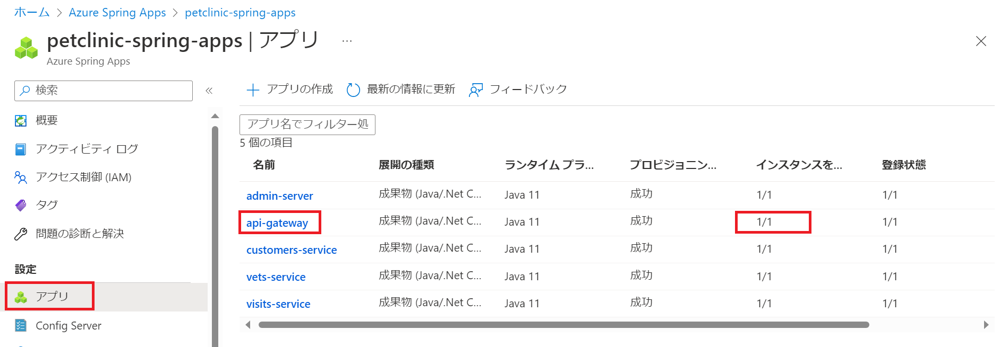
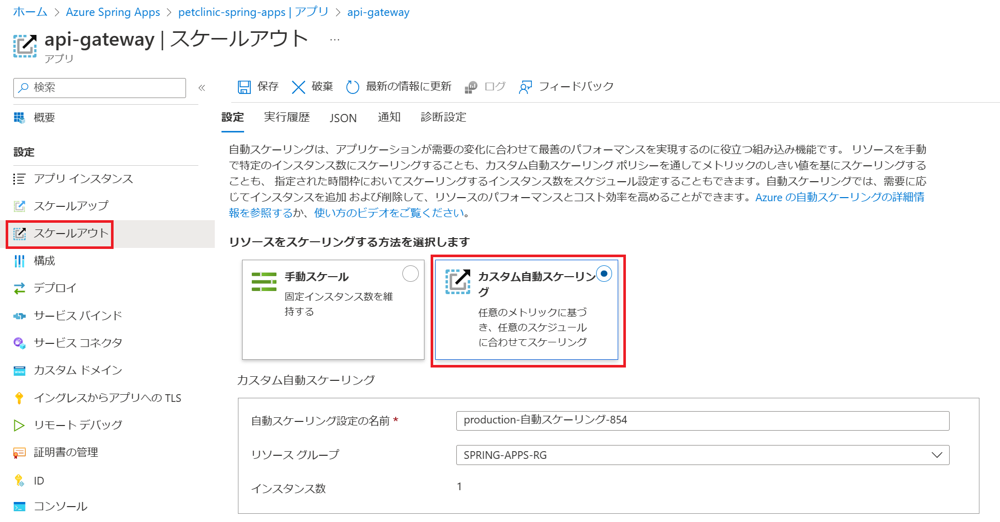
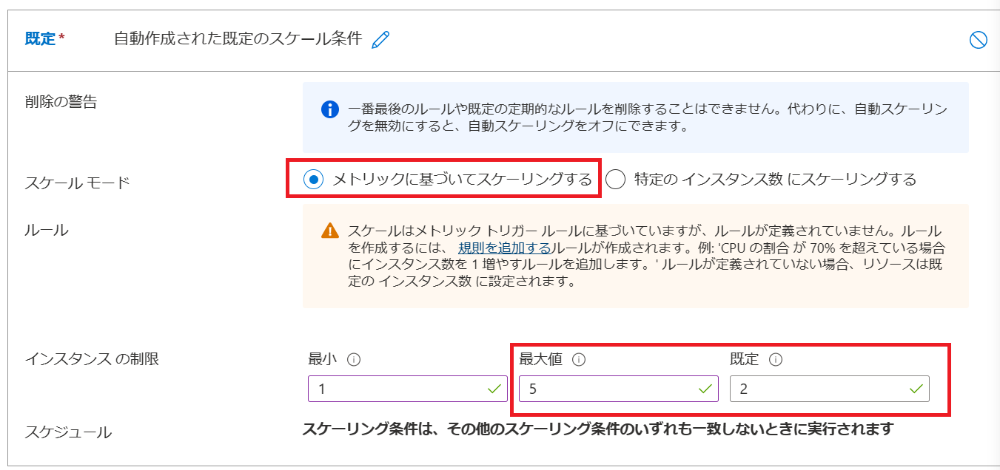
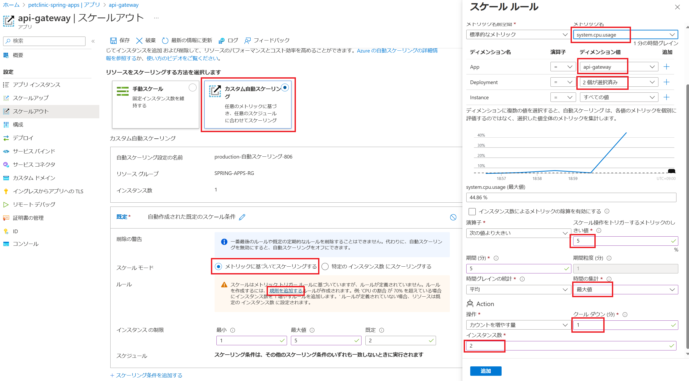
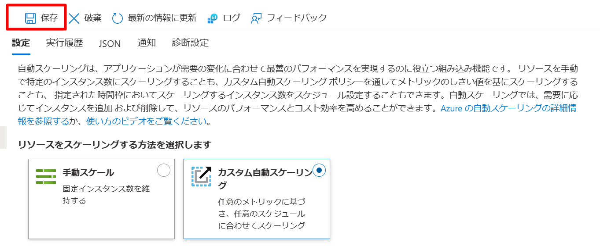

# 演習 5) タスク 1 - 自動スケーリングの条件を定義
Azure Spring Apps上のアプリケーションがメトリックに応じてスケールするように構成します。

なお、今回はテスト・動作確認を目的としているため、スケールのしきい値は低く設定しています。

## 作業
1. アプリ `api-gateway` にアクセスします。
   既存のインスタンス数は 1/1 (実行中のインスタンス数 / 合計のインスタンス数) です。

    

2. `スケールアウト`メニューを選択します。

    

3. `カスタム自動スケーリング`をチェックします。スケール モードは`メトリックに基づいてスケーリングする`を選択します。

    インスタンス の制限は以下に設定します。
    - 最大値: 5
    - 既定: 2

    

4. ルールを設定するために、`規則を追加する`リンクをクリックします。

    右側の`スケール ルール`画面にある下記の項目を設定します。`追加`ボタンを押下します。
    |  項目  |  値  |
    | ---- | ---- |      
    | メトリック名 | system.cpu.usage
    | ディメンション名 - App  | api-gateway
    | ディメンション名 - Deployment |  2 個が選択済み   
    | スケール操作をトリガーするメトリックのしきい値 | 5
    | 期間 (分) | 5
    | 時間の集計 | 最大値
    | グール ダウン (分) | 1
    | インスタンス数 | 2 

    

5. `保存`ボタンをクリックします。

    

## 参照情報
- <a href="https://learn.microsoft.com/ja-jp/azure/azure-monitor/autoscale/autoscale-get-started
" target="_blank">Azure での自動スケールの使用</a>
- <a href="https://learn.microsoft.com/ja-jp/azure/spring-apps/how-to-setup-autoscale" target="_blank">Azure Spring Apps アプリケーションの自動スケーリングを設定する</a>
- <a href="https://learn.microsoft.com/ja-jp/azure/spring-apps/concept-metrics" target="_blank">Azure Spring Apps のメトリック</a>

---
次の手順へ: [**タスク 2 - 自動スケーリングを体験**](P5-02.md)

前の手順へ: [**演習 4) タスク 4 - ログのリアルタイム監視**](P4-04.md)

READMEへ: [**README**](../README.md#%E6%93%8D%E4%BD%9C%E6%89%8B%E9%A0%86) 