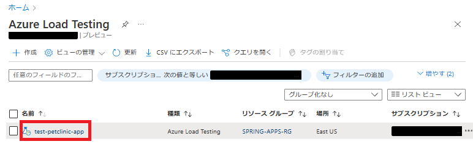
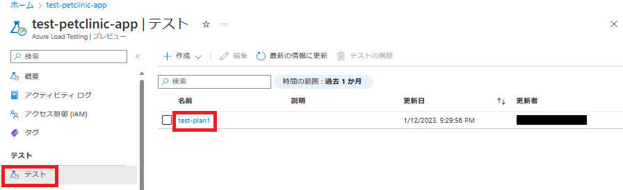
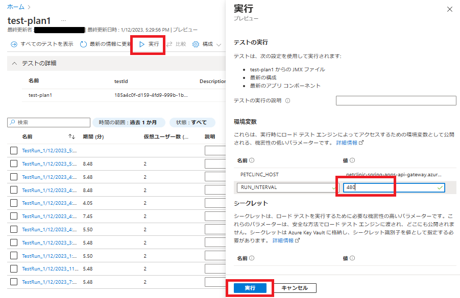
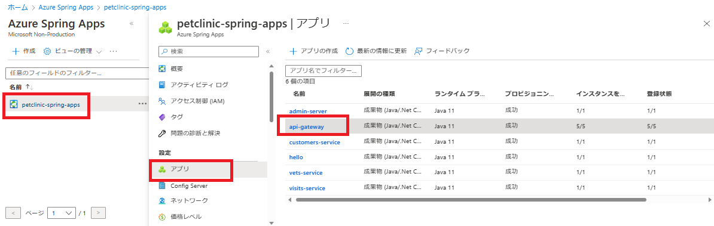
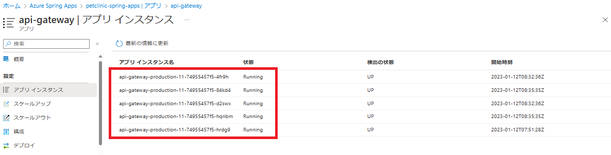
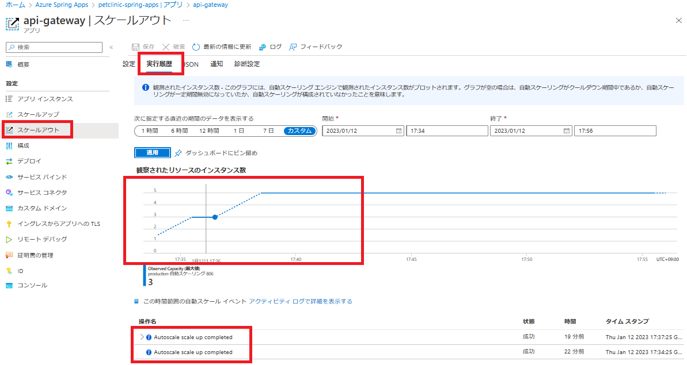

# 演習 5) タスク 2 - 自動スケーリングを体験

実際にAzure Load Testingで負荷をかけ、サービスのスケールアウト・スケールインを確認します。

## 作業
1. [Azure Load Testing リソース](https://portal.azure.com/?feature.customportal=false#view/HubsExtension/BrowseResource/resourceType/Microsoft.LoadTestService%2FLoadTests)へアクセスします。`リソース`を選択します。

    
 

2. 左側の`テスト`メニューをクリックします。`テストプラン`を選択します。

    
 

3. `実行`メニューをクリックします。観察しやすくするため、RUN_INTERVAL を やや長めの 480 に設定した上で、`実行`ボタンを押下します。

    
 

## 確認
1. アプリ `api-gateway` のページを開きます。

    
 

2. 左側の`アプリ インスタンス`メニューをクリックします。インスタンス数が 5 個になったことを確認します。

    
 

3. 左側の`スケールアウト`メニューをクリックします。`実行履歴`を選択します。

    2 回スケールアウトの操作が行われました。 
    - 1 回目: 元の 1 個から 2 個を追加して、3 個になりました。
    - 2 回目: クールダウンの 2 分経過後、さらに 2 個を追加して、5 個になりました。 

    
 

## 参照情報
- <a href="https://learn.microsoft.com/ja-jp/azure/azure-monitor/autoscale/autoscale-get-started
" target="_blank">Azure での自動スケールの使用</a>
- <a href="https://learn.microsoft.com/ja-jp/azure/spring-apps/how-to-setup-autoscale" target="_blank">Azure Spring Apps アプリケーションの自動スケーリングを設定する</a>
- <a href="https://learn.microsoft.com/ja-jp/azure/spring-apps/concept-metrics" target="_blank">Azure Spring Apps のメトリック</a>

---
前の手順へ: [**タスク 1 - スケールアウトの条件を定義**](P5-01.md)

READMEへ: [**README**](../README.md#%E6%93%8D%E4%BD%9C%E6%89%8B%E9%A0%86) 
