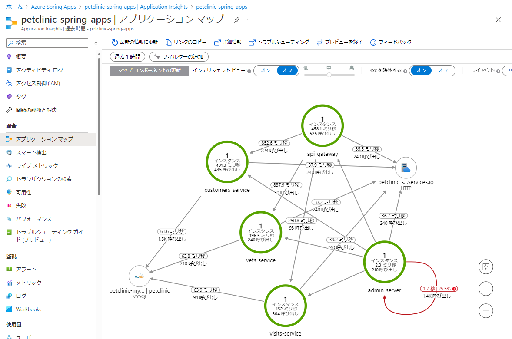
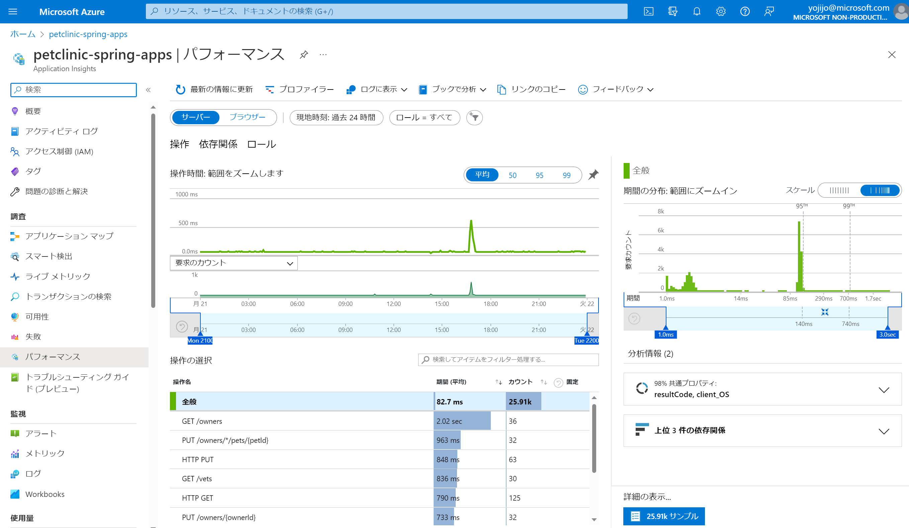
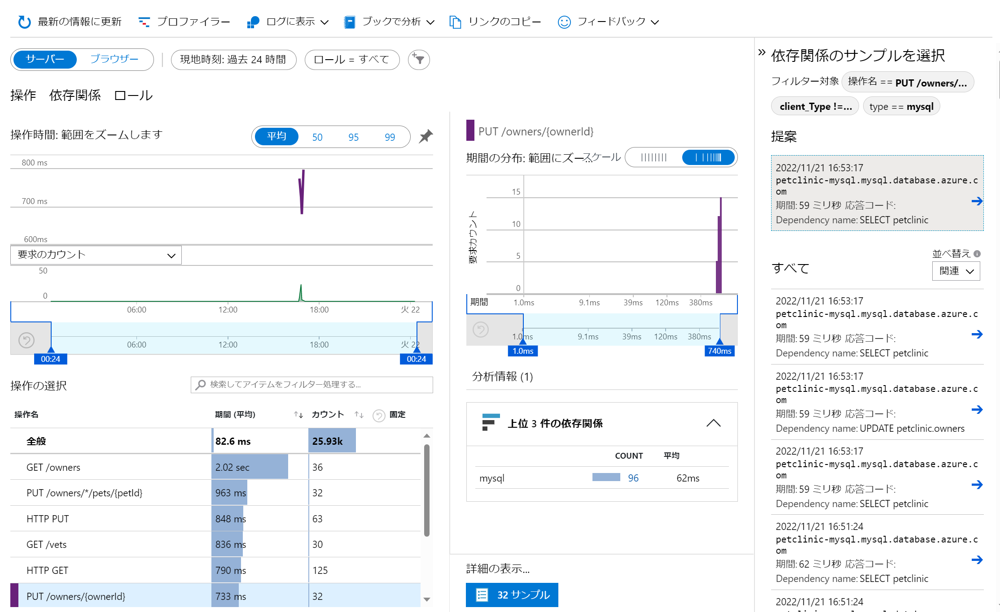
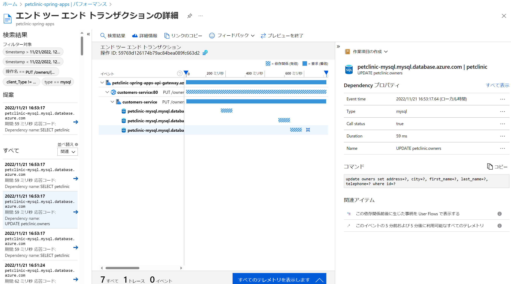
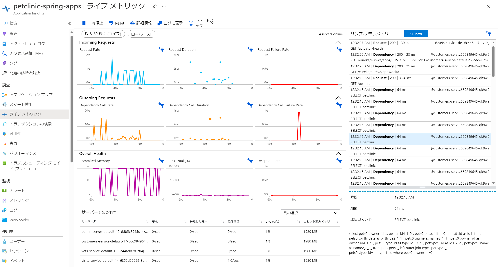
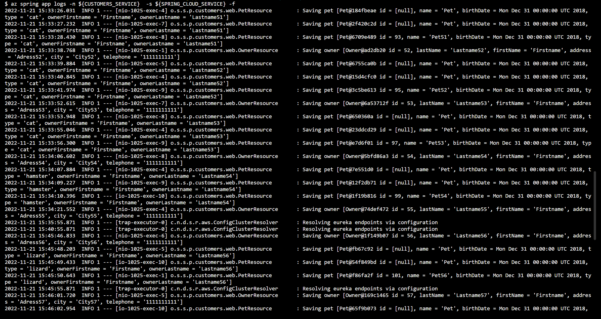

演習 1) タスク 3 - Azure Spring Apps の監視・ログ確認

# トラフィックの作成

https://github.com/joyoji/springapps-petclinic-microservices/blob/master/spring-petclinic-api-gateway/src/test/jmeter/petclinic_test_plan.jmx


# アプリの監視およびログの確認


## アプリケーション マップ
1. ポータルサイトの監視ツール Application Insight へアクセスします

    https://portal.azure.com/#view/HubsExtension/BrowseResource/resourceType/microsoft.insights%2Fcomponents

2. 対象の監視対象を選択します。次の画面に「アプリケーション マップ」をクリックします

    全てのコンポーネントおよび依存関係が表示されます。サービスのトポロジーを可視化にできます。
    いずれかのコンポーネントを選ぶと、関連する分析情報を表示したり、そのコンポーネントについてのパフォーマンスと障害のトリアージ機能にアクセスしたりすることができます。

    


## パフォーマンス
1. ポータルサイトの監視ツール Application Insight へアクセスします

    https://portal.azure.com/#view/HubsExtension/BrowseResource/resourceType/microsoft.insights%2Fcomponents

2. 対象の監視対象を選択します。次の画面に「パフォーマンス」をクリックします

    リクエストごとの平均レスポンス時間およびアクセス回数が表示されています。
    
    

    さらにリクエストと依存関係のある MySQL データベースのアクセスタイムも確認できます。
    MySQL へのアクセスがあるリクエストを選択して、右側の上位 3 件の依存関係をクリックします。
    MySQLsql のアクセスう件数および平均レスポンスタイムが表示されます。

    件数をクリックすると、右側にトランザクションのリストが表示されます。

    

3. 上記のトランザクションをクリックすると、各トランザクションの詳細が表示されます。    

        


## サービスのリアルタイム監視
1. ポータルサイトの監視ツール Application Insight へアクセスします

    https://portal.azure.com/#view/HubsExtension/BrowseResource/resourceType/microsoft.insights%2Fcomponents

2. 対象の監視対象を選択します。次の画面に「ライブ メトリック」をクリックします

    Incoming Requests / Outgoing Requests および各サービスの失敗リクエスト数・CPU・メモリなどの情報はリアルタイムで表示されます。

       


## ログのリアルタイム監視
1. Bash ターミナル画面を開きます、プロジェクト **Azure Spring Apps** へ移動
    ```bash
　　cd ${Project_Path}
    source .scripts/setup-env-variables-azure.sh
    ```

2. 環境変数を導入します。
    ```bash

    ```

3. 以下のコマンドを実行します
    ```bash
    az spring app logs -n ${CUSTOMERS_SERVICE}  -s ${SPRING_CLOUD_SERVICE} -f
    ```
    <b>

    対象サービスのログをリアルタイムで出力されます。 

       
