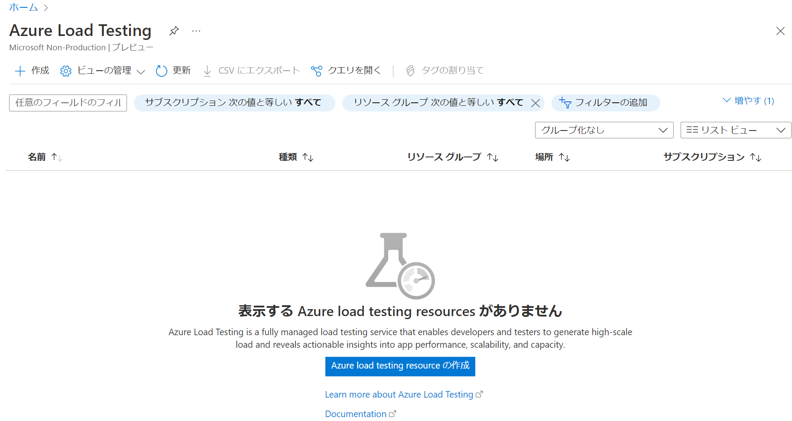
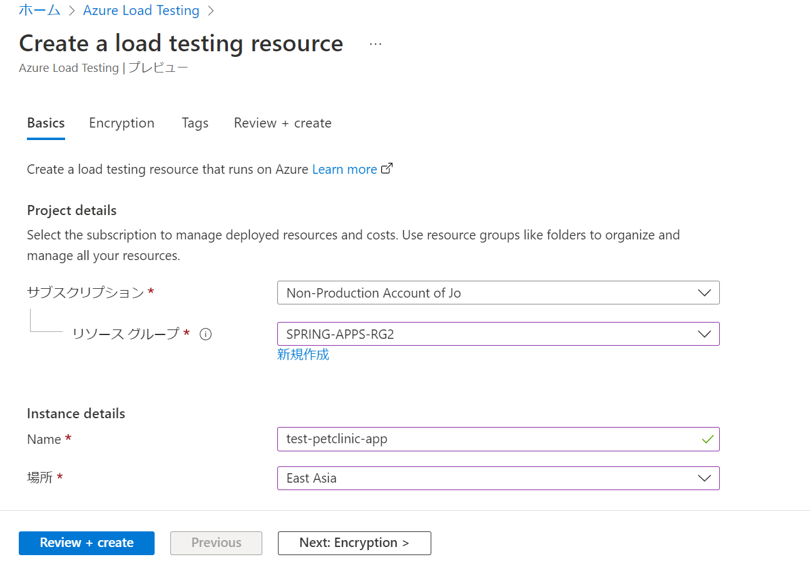
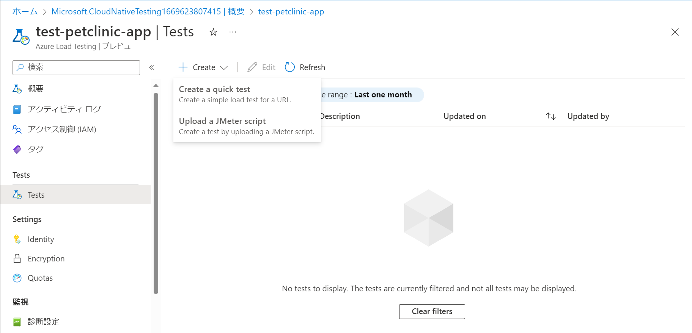
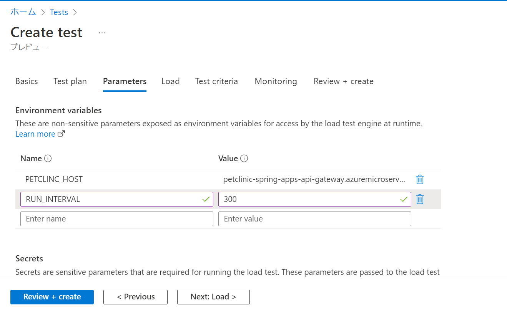
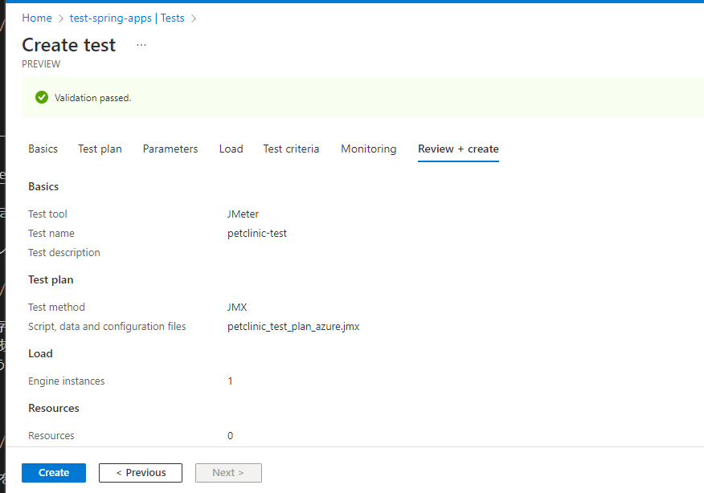

演習 1) タスク 3 - Azure Spring Apps の監視・ログ確認

# トラフィックの作成
監視データを観測しやすくため、継続でアプリのエンドポイントへアクセスさせます。
アプリは複数のマイクロサービスで構成されています、Azure Load Testing サービスでトラフィックを生成します。

1. Azure Load Testing のリソースを作成します

    https://portal.azure.com/#view/HubsExtension/BrowseResource/resourceType/Microsoft.LoadTestService%2FLoadTests

    

        

2. テストプランを新規追加します。

    


    パラメーターとして以下の環境変数を定義します。    
    PETCLINC_HOST: アクセス先のURLとなります、https抜きの部分を入力
    THREAD_CNT: 同時アクセスユーザーを表すスレッドの数となります、デフォルトで 2 を入力
    RUN_INTERVAL: 単位が秒である、実行期間となります、デフォルトで 300 を入力
    
        

       


# アプリの監視およびログの確認


## アプリケーション マップ
1. ポータルサイトの監視ツール Application Insight へアクセスします

    https://portal.azure.com/#view/HubsExtension/BrowseResource/resourceType/microsoft.insights%2Fcomponents

2. 対象の監視対象を選択します。次の画面に「アプリケーション マップ」をクリックします

    全てのコンポーネントおよび依存関係が表示されます。サービスのトポロジーを可視化にできます。
    いずれかのコンポーネントを選ぶと、関連する分析情報を表示したり、そのコンポーネントについてのパフォーマンスと障害のトリアージ機能にアクセスしたりすることができます。

    


## パフォーマンス
1. ポータルサイトの監視ツール Application Insight へアクセスします

    https://portal.azure.com/#view/HubsExtension/BrowseResource/resourceType/microsoft.insights%2Fcomponents

2. 対象の監視対象を選択します。次の画面に「パフォーマンス」をクリックします

    リクエストごとの平均レスポンス時間およびアクセス回数が表示されています。
    
    

    さらにリクエストと依存関係のある MySQL データベースのアクセスタイムも確認できます。
    MySQL へのアクセスがあるリクエストを選択して、右側の上位 3 件の依存関係をクリックします。
    MySQLsql のアクセスう件数および平均レスポンスタイムが表示されます。

    件数をクリックすると、右側にトランザクションのリストが表示されます。

    

3. 上記のトランザクションをクリックすると、各トランザクションの詳細が表示されます。    

        


## サービスのリアルタイム監視
1. ポータルサイトの監視ツール Application Insight へアクセスします

    https://portal.azure.com/#view/HubsExtension/BrowseResource/resourceType/microsoft.insights%2Fcomponents

2. 対象の監視対象を選択します。次の画面に「ライブ メトリック」をクリックします

    Incoming Requests / Outgoing Requests および各サービスの失敗リクエスト数・CPU・メモリなどの情報はリアルタイムで表示されます。

       


## ログのリアルタイム監視
1. Bash ターミナル画面を開きます、プロジェクト **Azure Spring Apps** へ移動
    ```bash
    cd ${Project_Path}
    source .scripts/setup-env-variables-azure.sh
    ```

2. 以下のコマンドを実行します
    ```bash
    az spring app logs -n ${API_GATEWAY}  -s ${SPRING_APPS_SERVICE} -f
    ```
    <b>

    対象サービスのログをリアルタイムで出力されます。 その他のサービスは以下のコマンドでログを照会できます。
    ```bash
    az spring app logs -n ${CUSTOMERS_SERVICE}  -s ${SPRING_APPS_SERVICE} -f

    az spring app logs -n ${VISITS_SERVICE}  -s ${SPRING_APPS_SERVICE} -f

    az spring app logs -n ${VETS_SERVICE}  -s ${SPRING_APPS_SERVICE} -f

    az spring app logs -n ${ADMIN_SERVER}  -s ${SPRING_APPS_SERVICE} -f        

    ```


       

---
次の手順へ: [**タスク X - XXXXXX**](P2-02.md)

前の手順へ: [**準備: XXXXXXX**](P2-00.md)

READMEへ: [**README**](../README.md#%E6%93%8D%E4%BD%9C%E6%89%8B%E9%A0%86) 