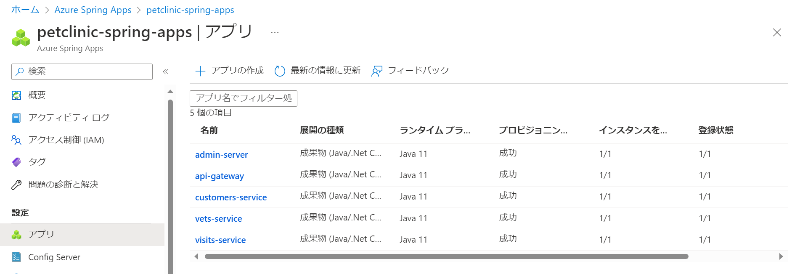
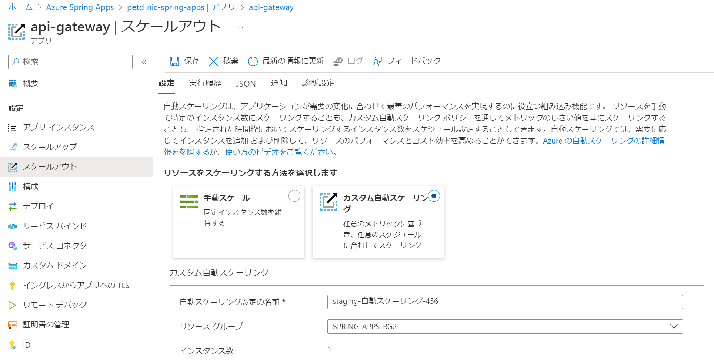
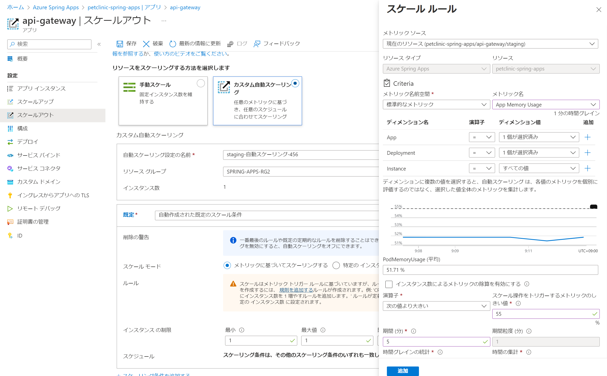
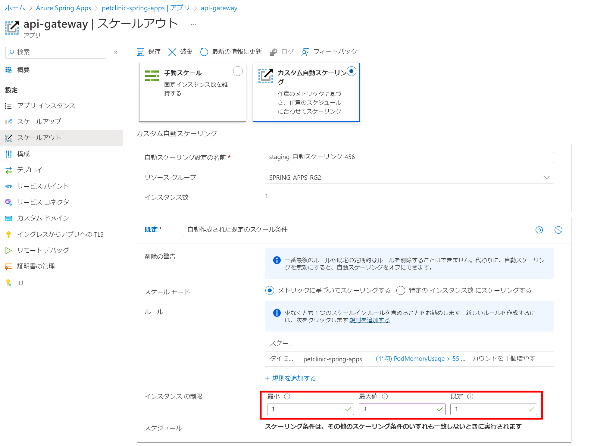

演習 X) タスク 1 - Azure Spring Apps の自動スケーリング

# スケールアウトの条件を定義
1. 対象のアプリ api-gateway にアクセスします
    既存のインスタンス数は 1/1 (実行中のインスタンス数 / 合計のインスタンス数) となります。

    

2. スケールアウト メニューを選択します

    

3. 自動スケーリングにチェックをいれます、
   スケール ルールの詳細定義画面に、以下の基準を設定します。
   
    メトリック名： App Memory Usage
    スケール操作をトリガーするメトリックのしきい値：PodMemoryUsage (平均) より上回りの 55% 
    期間 (分)：5 

    追加ボタンを押して保存します

    

4. インスタンスの制限を以下に設定してから、保存ボタンを押しします

    最小：１
    最大値：３
    規定：１

    

# 負荷を掛ける
XXX 手順を参考にして、継続的にアクセスするトラフィックを生成します。

# スケールアウトの結果を確認
1. 対象のアプリ api-gateway にアクセスします、最新のインスタンス数を確認します。

